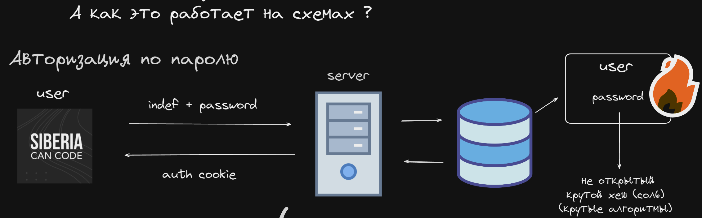

[База знаний](../Main.md)

# Аутентификация

## Глоссарий

**Идентификация** - Проверка, в результате выполнения которой для субъекта идентификации выявляется идентификатор.  
**Аутентификация** - Проверка подлинности предъявленного пользователем идентификатора.  
**Авторизация** - Предоставление субъекту определенных прав.  
**Регистрация** - Процесс создания учетной записи.  
**Верификация** - Процедура проверки активности идентификатора.

#### Способы аутентификации

- Пароль
- One-Time-Password
- Token
- Сертификат
- Биометрия
- ...

## Cookie

- Basic
- Bearer

## Session

## JWT

Требования к системе Аутентификация:

1. Регистрация
1. Логин
1. Подтвердить email
1. Восстановить пароль
1. Уничтожить все сессии

auth middlewares - это  
auth attributes - это  
auth decorators - это  
auth guards - это

### RBAC (Role-Based Access Control) TODO!
