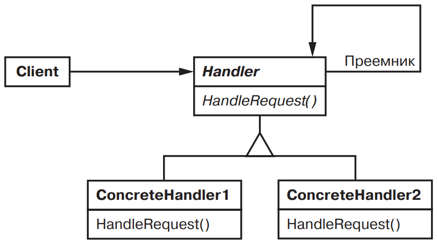
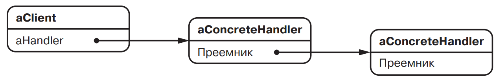

[Паттерны](../../Patterns.md)

tags:

- #architecture
- #behavioral
- #coupling

**Назначение**: Позволяет избежать привязки отправителя запроса к его получателю, предоставляя возможность обработать запрос нескольким объектам. Связывает объекты получатели в цепочку и передает запрос этой цепочке, пока он не будет обработан.

**Применимость**:

- Запрос может быть обработам более чем одним объектом, причем настоящий обработчик заранее неизвестен и должен быть найден автоматически.

- Запрос должен быть отправлен одному из нескольких объектов, без явного указания, какому именно

- Набор объектов, способных обработать запрос, должен задаваться динамически.

**Структура**:


Структура объектов:



**Результаты**:

- Ослабление связанности(coupling). Отправитель и получатель ничего не знают друг о друге, а включенный в цепочку объект - о структуре цепочки

- Дополнительная гибкость при распределении обязанностей между объектами. Добавить или изменить обязанности по обработке запроса можно, включив в цепочку новых участников или изменив ее каким-то другим образом.

- Получение не гарантированно. Поскольку у запроса нет явного получателя, то нет и гарантий, что он вообще будет обработан: он может достичь конца цепочки и пропасть. Необработанным запрос может оказаться и в случае неправильной конфигурации цепочки.

**Реализация**:

<details>
    <summary>Code Example</summary>

```js
const NO_HELP_TOPIC = -1;
const PRINT_TOPIC = 1;
const PAPER_ORIENTATION_TOPIC = 2;
const APPLICATION_TOPIC = 3;

class HelpHandler {
	constructor(helpHandler = 0, topic = NO_HELP_TOPIC) {
		this.successor = helpHandler;
		this.topic = topic;
	}

	hasHelp() {
		return this.topic !== NO_HELP_TOPIC;
	}
	setHandler(handler) {
		this.successor = handler;
	}
	handleHelp() {
		if (this.successor !== 0) {
			this.successor.handleHelp();
		}
	}
}

class Widget extends HelpHandler {
	constructor(widget, topic = NO_HELP_TOPIC) {
		super(widget, topic);
		this.parent = widget;
	}

	handleHelp() {
		if (this.hasHelp()) {
			console.log(this.topic);
		} else {
			const proto = Object.getPrototypeOf(this);
			proto.handleHelp();
		}
	}
}

class Button extends Widget {
	constructor(widget, topic = NO_HELP_TOPIC) {
		super(widget, topic);
	}

	handleHelp() {
		if (this.hasHelp()) {
			console.log(this.topic);
		} else {
			const proto = Object.getPrototypeOf(this);
			proto.handleHelp();
		}
	}
}

class Dialog extends Widget {
	constructor(widget, topic = NO_HELP_TOPIC) {
		super(widget, topic);
	}
	handleHelp() {
		if (this.hasHelp()) {
			console.log(this.topic);
		} else {
			const proto = Object.getPrototypeOf(this);
			proto.handleHelp();
		}
	}
}

class Application extends HelpHandler {
	constructor(topic) {
		super(0, topic);
	}

	handleHelp() {
		// показать список разделов справки
	}
}

const application = new Application(APPLICATION_TOPIC);
const dialog = new Dialog(application, PRINT_TOPIC);
const button = new Button(dialog, PAPER_ORIENTATION_TOPIC);

button.handleHelp();
```

</details>
