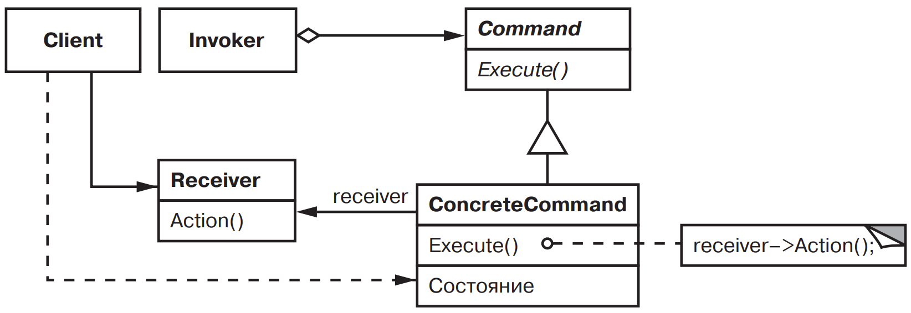

[Паттерны](../../Patterns.md)

# Command

tags:

- #architecture
- #behavioral

**Назначение**: Инкапсулирует действие в объекте, строке или числе; позволяя параметризировать клиентов, ставить запросы в очередь, или протоколировать их

**Применимость**:

- Определение, постановка в очередь и выполнение запросов в разное время

- Поддержка отмены операций

- Поддержка протоколирования изменений, чтобы их можно было выполнить повторно после.

- Структурирование системы на основе высокоуровневых операций, построенных из примитивны.

- Параметризация объектов выполняемым действием.(в процедурных языках можно выразить callback'ом)

**Структура**:


**Результаты**:

- _Command_ отделяет объект, инициирующий операцию, от объекта располагающего информацией о том, как ее выполнить.

- Command можно обрабатывать и расширять точно так же как другие объекты

- из простых Command можно собирать составные

- новая Command добавляются легко, поскольку никакие существующие классы обновлять не нужно

**Реализация**:

<details>
    <summary>Code Example</summary>

```js
class Command {
	execute() {
		throw new Error('Command: execute is not implemented');
	}
}

class Open extends Command {
	constructor(application) {
		super();
		this.application = application;
		this.response;
	}

	#askUser() {
		return 'new document';
	}

	execute() {
		const name = this.#askUser();
		if (name.length > 0) {
			const document = new Document(name);
			this.application.add(document);
			document.open();
		}
	}
}

class Paste extends Command {
	constructor(document) {
		super();
		this.document = document;
	}
	execute() {
		this.document.paste();
	}
}

class SimpleCommand extends Command {
	constructor(receiver, action) {
		super();
		this.receiver = receiver;
		this.action = action;
	}

	execute() {}
}

class MacroCommand extends Command {
	constructor() {
		super();
		this.commands = new Set();
	}

	add(command) {
		this.commands.add(command);
	}
	remove(command) {
		this.commands.delete(command);
	}

	execute() {
		for (const command of this.commands) {
			command.execute();
		}
	}
	unexecute() {}
}

class Application {}
class Document {
	constructor(name) {
		this.name = name;
	}
	open() {}
	paste() {}
}
```

</details>
