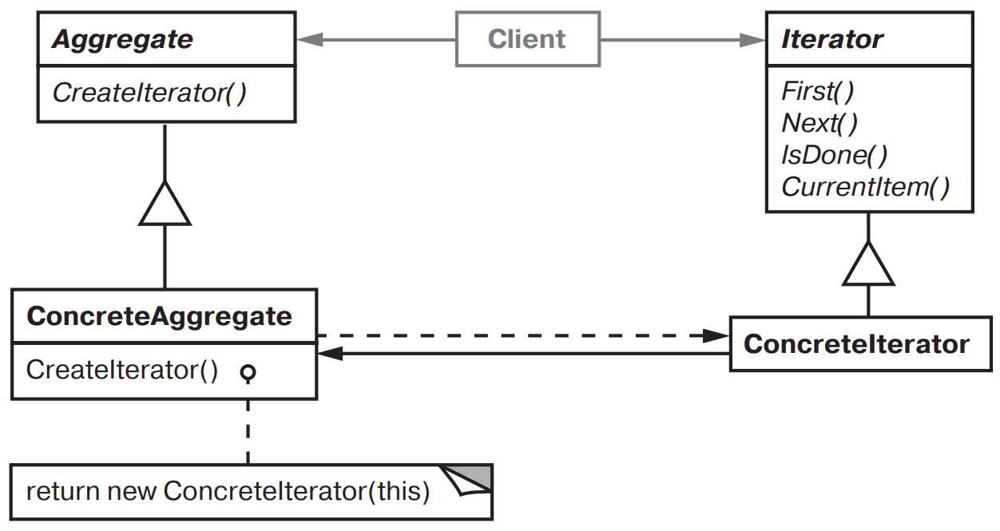

[Паттерны](../../Patterns.md)

tags:

- #architecture
- #behavioral

**Назначение**: Предоставляет способ последовательного обращения ко всем элементам составного объекта без раскрытия его внутреннего представления.

**Применимость**:

- Обращение к содержимому агрегированных объектов без раскрытия их внутреннего представления.

- Поддержка нескольких активных обходова одно и того же агрегированного объекта.

- Предоставление единообразного интерфейса для обхода различных агрегированных структур.

**Структура**:


**Результаты**:

- Поддержка разных способов обхода агрегата.

- Упрощение интерфейса класса _Aggregate_

- Возможность наличия нескольких активных обходов для агрегата.

**Реализация**:

- _Кто управляет итерацией?_  
  Если итерацией управляет клиент, то итератор называется внешним, в противном случае внутренним

  Внешний (Symbol.iterator)

  - Клиенты должны явно запросить следующий элемент.
  - Внешние итераторы обладают большей гибкостью/

  Внутренний (map, for each ...)

  - Проще в использовании
  - Клиент передает итератору обработчик, а итератор сам ее применяет.

- Алгоритм обхода может определить сам агрегат и использовать итератор только для хранения состояния итерации - Курсор.

- Устойчивый итератор (robust) гарантирует, что ни вставки, ни удаления не помешают обходу, причем достигается это без копирования итератора.  
  В большинстве реализаций итератор регистрируется в агрегате. При вставке или удалении агрегат либо корректирует внутреннее состояние всех созданных им итераторов, либо организует внутреннюю информацию так, чтобы обход выполнялся правильно.

- Итераторы для составных объектов. ...

<details>
 <summary>Code Example</summary>
 ```js
 ```
</details>
