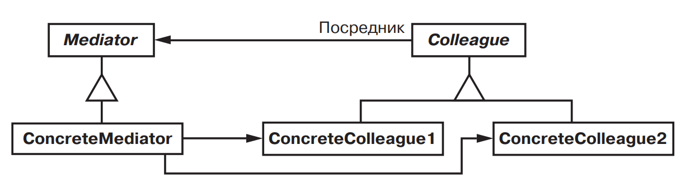
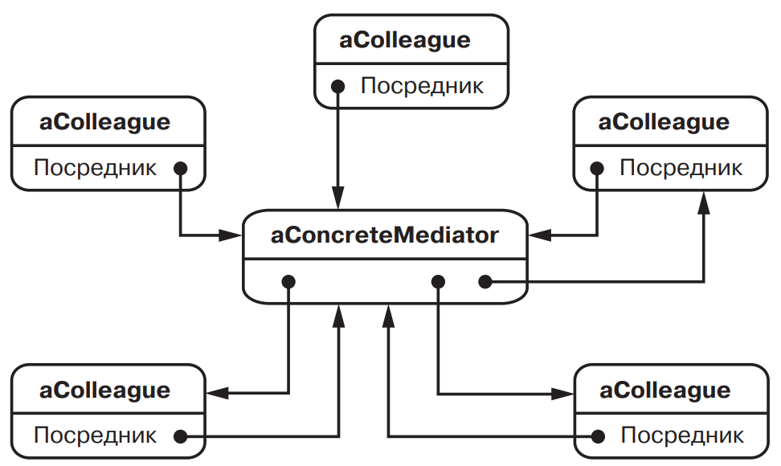

[Паттерны](../../Patterns.md)

tags:

- #architecture
- #behavioral
- #coupling

**Назначение**: Определяет объект инкапсулирующий способ взаимодействия множества объектов. _Mediator_ обеспечивает слабую связанность, избавляя объекты от необходимости явно ссылаться друг на друга и позволяя тем самым независимо изменять взаимодействия между ними.

**Применимость**:

- Существование объектов, связи между которыми сложны и четко определены. Получающиеся при этом взаимозависимости не структурированны и трудны для понимания.

- Повторное использование объекта затруднено, поскольку он обменивается информацией со многими другими объектами.

- Поведение, распределенное между несколькими классами, должно настраиваться без порождения множества классов.

**Структура**:



Типичная структура объектов:



**Результаты**:

- Снижение числа порождаемых подклассов. Посредник локализует поведение, которое в противном случа пришлось бы распределять

- Ослабление связей между коллегами. Посредник обеспечивает слабую связанность(coupling) коллег. Изменять классы _Colleague_ и _Mediator_ можно независимо друг от друга.

- Упрощение протоколов взаимодействия объектов.

- Абстрагирование способа кооперирования объектов.

- Централизация управления.

**Реализация**:

<details>
    <summary>Code Example</summary>

```js

```

</details>
