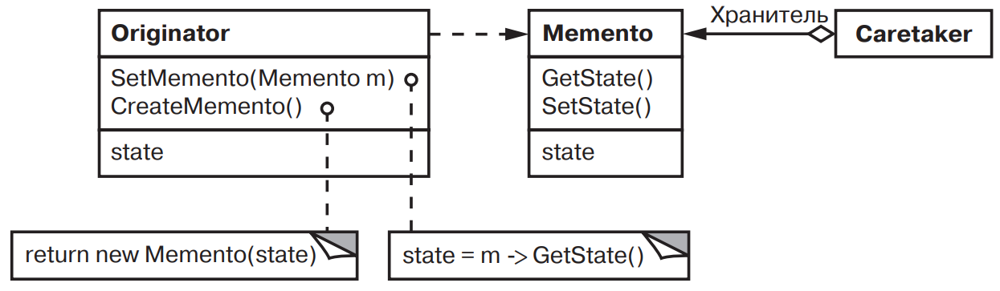
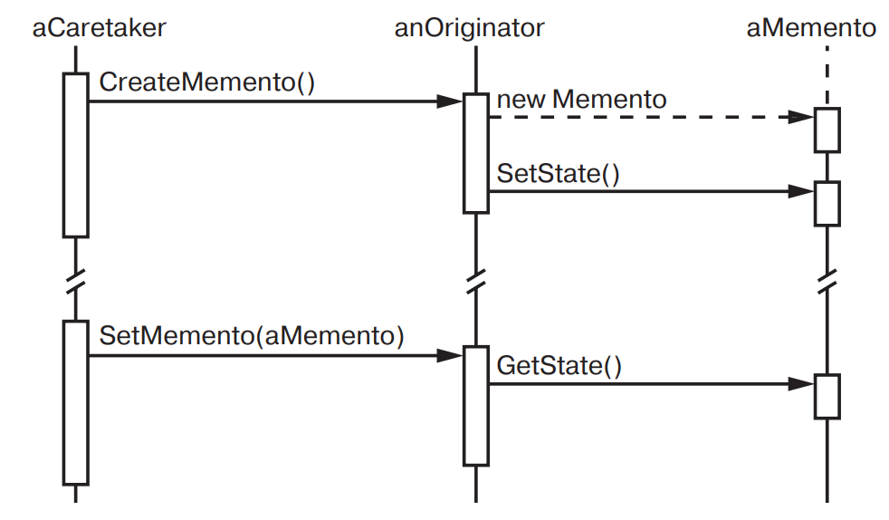

[Паттерны](../../Patterns.md)

tags:

- #architecture
- #behavioral

**Назначение**: Не нарушая инкапсуляции, фиксирует и выносит за пределы объекта его внутреннее состояние, так чтобы позднее можно было восстановить в нем объект.

**Применимость**:

- Необходимость сохранения снимка состояния объекта (или его части), чтобы впоследствии объект можно было восстановить в том же состоянии, и

- прямой интерфейс для получения этого состояния привел бы к раскрытию подробностей реализации и нарушению инкапсуляции объекта.

**Структура**:



**Результаты**:

- Сохранение границ инкапсуляции.  
  Хранитель позволяет избежать раскрытия информации, которой должен распоряжаться только **хозяин**, но которую тем не менее необходимо хранить вне последнего. Этот паттерн изолирует объекты от потенциально сложного внутреннего устройства **хозяина**, не изменяя границы инкапсуляции.

- Упрощение структуры хозяина.  
  При других вариантах дизайна, сохраняющего границы инкапсуляции, **хозяин** хранит внутри себя версии внутреннего состояния, которое запрашивали клиенты. Таким образом, вся ответственность за управлению памятью лежит на **хозяине**. При перекладывании заботы о запрошенном состоянии на клиентов упрощается структура хозяина, а клиентам дается возможность не информировать хозяина о том, что они закончили работу.

- Потенциальные затраты при использовании хранителей.  
  С хранителями могут быть связаны заметные затраты, если **хозяин** должен копировать большой объем информации для сохранения хранителя в памяти, или если клиенты создают или возвращают хранители достаточно часто. Если затраты на инкапсуляцию и восстановление состояния хозяина велики, то этот паттерн не всегда подходит.

- Определение "узкого" и "широкого" интерфейсов.  
  В некоторых языках сложно гарантировать, что только один хозяин может получить доступ к состоянию хранителя.

- Скрытая плата за содержание хранителя.  
  Посыльный отвечает за удаление хранителя, однако не располагает информацией о том, какой объем информации скрыт в нем. Следовательно, нетребовательный к ресурсам посыльный может расходовать очень много памяти при работе с хранителем.

**Реализация**:

<details>
 <summary>Code Example</summary>

```js
class Graphic {}
// Базовый класс графических объектов

class MoveCommand {
	constructor(target, delta) {
		this.state;
		this.delta = delta;
		this.target = target;
	}
	execute() {
		const solver = ConstraintSolver.Instance();
		this.state = solver.createMemento();
		// Создание хранителя
		this.target.move(this.delta);
		solver.solve();
	}
	unexecute() {
		const solver = ConstraintSolver.Instance();
		this.target.move(-this.delta);
		solver.setMemento(this.state);
		// Восстановление состояния
		solver.solve();
	}
}

class ConstraintSolver {
	constructor() {}

	instance = null;
	static Instance() {
		if (ConstraintSolver.instance === null) {
			ConstraintSolver.instance = new ConstraintSolver();
		}
		return ConstraintSolver.instance;
	}

	solve() {}
	addConstraint(startConnection, endConnection) {}
	removeConstraint(startConnection, endConnection) {}

	createMemento() {}
	setMemento() {}
}

class ConstraintSolverMemento {
	constructor() {}
}
```

</details>
