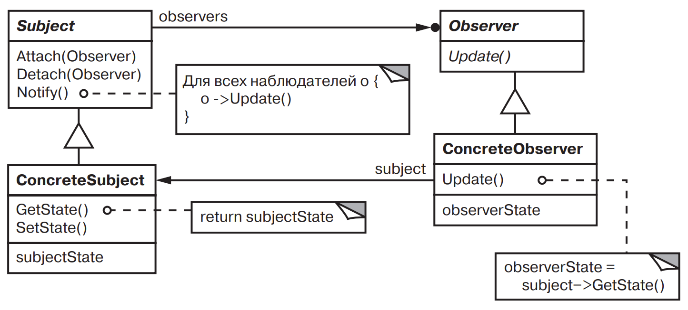

[Паттерны](../../Patterns.md)

tags:

- #architecture
- #behavioral

**Назначение**: Определяет зависимость типа “один ко многим” между объектами таким образом, что при изменении состояния одного объекта все зависящие от него оповещаются об этом и автоматически обновляются

**Применимость**:

- При модификации одного объекта требуется изменить другие.

- Один объект должен оповещать других, не зная об уведомляемых объектах.
  Объекты не должны быть тесно связанны

**Структура**:



**Результаты**:

- Позволяет изменять _Subject’s_ и _Observer’s_ независимо друг от друга

- Абстрактная связанность _Subject_ и _Observer_. _Subject_ имеет информацию лишь о том что у него есть ряд наблюдателей.  
  _Subject_ и _Observer_ не являются тесно связанными, они могут находиться на разных уровнях абстракции системы. Субъект более низкого уровня может уведомлять наблюдателей, находящихся на верхних уровнях, не нарушая иерархии системы.

- Поддержка широковещательных коммуникаций. Уведомление автоматически поступает ко всем подписавшимся на него объектам.

- **Неожиданные обновления**.  
  Поскольку наблюдатели не располагают информацией друг о друге, им неизвестно о том, во что обходится изменение субъекта. Безобидная операция над субъектом может вызвать целый ряд обновлений наблюдателей и зависящих от них объектов.

**Реализация**:

<details>
    <summary>Code Example</summary>

```js
class AbstractObserver {
	update() {
		throw new Error('Observer.update is not implemented');
	}
}

class AbstractSubject {
	constructor() {
		this.observers = new Set();
	}
	attach(observer) {
		this.observers.add(observer);
	}
	detach(observer) {
		this.observers.delete(observer);
	}
	notify() {
		for (const observer of this.observers) {
			observer.update(this);
		}
	}
}

class ClockTimer extends AbstractSubject {
	constructor() {
		super();
		this.time = new Date(Date.now());
		this.interval = setInterval(() => {
			this.time = new Date(Date.now());
			this.tick();
		}, 1000);
	}

	getHours() {
		return this.time.getHours();
	}
	getMinutes() {
		return this.time.getMinutes();
	}
	getSeconds() {
		return this.time.getSeconds();
	}
	getTime() {
		return this.time.getTime();
	}

	destroy() {
		clearInterval(this.interval);
	}

	tick() {
		this.notify();
	}
}

class DigitalClock extends AbstractObserver {
	constructor(timer) {
		super();
		this.subject = timer;
		this.subject.attach(this);
	}
	destroy() {
		this.subject.detach(this);
	}

	update(changedSubject) {
		if (changedSubject === this.subject) {
			this.draw();
		}
	}

	draw() {
		console.log(
			'Digital:' +
				this.subject.getHours() +
				':' +
				this.subject.getMinutes() +
				':' +
				this.subject.getSeconds(),
		);
	}
}

class AnalogClock extends AbstractObserver {
	constructor(timer) {
		super();
		this.subject = timer;
		this.subject.attach(this);
	}
	destroy() {
		this.subject.detach(this);
	}

	update(changedSubject) {
		if (changedSubject === this.subject) {
			this.draw();
		}
	}

	draw() {
		console.log('Analogue: ', this.subject.getTime());
	}
}

const clockTimer = new ClockTimer();

const digitalClock = new DigitalClock(clockTimer);
const analogClock = new AnalogClock(clockTimer);

clockTimer.tick();
```

</details>
