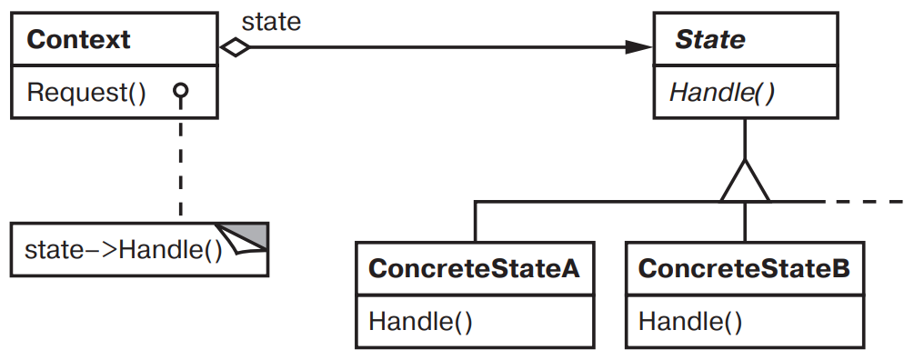

[Паттерны](../../Patterns.md)

# State

tags:

- #architecture
- #behavioral

**Назначение**: Позволяет объекту изменить свое поведение в зависимости от внутреннего состояния. Извне создается впечатление, что изменился класс объекта

**Применимость**:

- Поведение объекта зависит от состояния и должно изменяться во время выполнения.

- Когда в коде операций встречаются состоящие из многих ветвей условные операторы, в которых выбор ветви зависит от состояния. Обычно в таком случае состояние представлено перечисляемыми константами. Часто одна и та же структура условного оператора повторяется в нескольких операциях. Паттерн _State_ предлагает поместить каждую ветвь в отдельный класс. Это позволяет трактовать состояние объекта как самостоятельный объект, который не может изменяться независимо от других.

**Структура**:



**Результаты**:

- Локализация поведения зависящего от состояния, и деление его на части, соответствующие состояниям.  
  Помещает все поведение, ассоциированное с конкретным состоянием, в отдельный объект. Поскольку зависящий от состояния код целиком находится в одном из подклассов класса State, то добавлять новые состояния и переходы можно просто путем порождения новых подклассов.

- Явно выраженные переходы между состояниями.  
  Ввод отдельных объектов для различных состояний делает переходы более явными.

- Возможность совместного использования объектов состояния.

**Реализация**:

<details>
<summary>Code Example</summary>

```js
class TCPOctetStream {}

class TCPState {
	transmit(tcpConnection, tcpOctetStream) {}
	activeOpen(tcpConnection) {}
	passiveOpen(tcpConnection) {}
	close(tcpConnection) {}
	synchronize(tcpConnection) {}
	acknowledge(tcpConnection) {}
	send(tcpConnection) {}

	changeState(tcpConnection, tcpState) {
		tcpConnection.changeState(tcpState);
	}
}

class TCPConnection {
	constructor() {
		this.state = TCPClosed.Instance();
	}

	activeOpen() {
		this.state.activeOpen(this);
	}
	passiveOpen() {
		this.state.passiveOpen(this);
	}
	close() {
		this.state.close(this);
	}
	send() {}
	acknowledge() {
		this.state.acknowledge(this);
	}
	synchronize() {
		this.state.synchronize(this);
	}

	processOctet() {}

	changeState(tcpState) {
		this.state = tcpState;
	}
}

class TCPEstablished extends TCPState {
	instance = null;
	static Instance() {
		if (TCPEstablished.instance === null) {
			TCPEstablished.instance = new TCPEstablished();
		}
		return TCPEstablished.instance;
	}
	close(tcpConnection) {
		// Послать FIN, получить ACK для FIN
		this.changeState(tcpConnection, TCPListen.Instance());
	}
	transmit(tcpConnection, tcpOctetStream) {
		tcpConnection.processOctet(tcpOctetStream);
	}
}
class TCPListen extends TCPState {
	instance = null;
	static Instance() {
		if (TCPListen.instance === null) {
			TCPListen.instance = new TCPListen();
		}
		return TCPListen.instance;
	}

	send(tcpConnection) {
		// Послать SYN, получить SYN, и т.д.
		this.changeState(tcpConnection, TCPEstablished.Instance());
	}
}
class TCPClosed extends TCPState {
	instance = null;
	static Instance() {
		if (TCPClosed.instance === null) {
			TCPClosed.instance = new TCPClosed();
		}
		return TCPClosed.instance;
	}

	activeOpen(tcpConnection) {
		// Послать SYN, получить SYN, ACK и т.д.
		this.changeState(tcpConnection, TCPEstablished.Instance());
	}
	passiveOpen(tcpConnection) {
		this.changeState(tcpConnection, TCPListen.Instance());
	}
}
```

</details>
