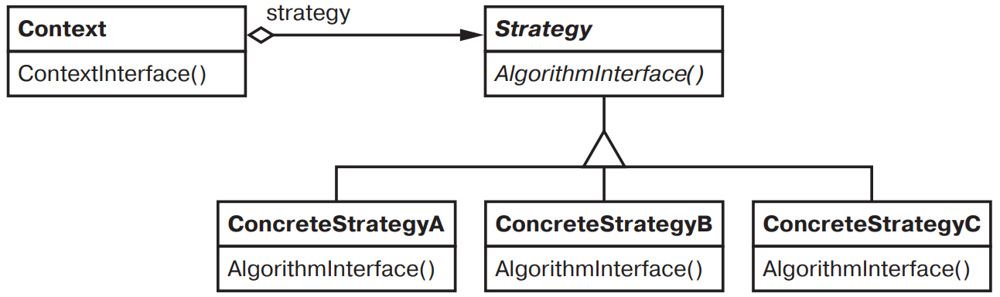

[Паттерны](../../Patterns.md)

# Strategy

tags:

- #architecture
- #behavioral

**Назначение**: Определяет семейство алгоритмов, инкапсулирует каждый из них и делает взаимозаменяемыми. _Strategy_ позволяет изменять алгоритмы независимо от клиентов, которые ими пользуются.

**Применимость**:

- Наличие множества родственных классов, отличающихся только поведением

- Наличие нескольких разновидностей алгоритма.

- В алгоритме содержатся данные, о которых клиент не должен "знать".

- В классе определенно много вариантов поведения, представленных разветвленными условными операторами.

**Структура**:



**Результаты**:

- Семейства родственных алгоритмов.

- Альтернатива порождению классов.

- Стратегии позволяют избавится от условных конструкций

- Выбор реализации.

- Клиенты должны знать о различных стратегиях

- Затраты на передачу информации между стратегией и контекстом.

- Увеличение числа объектов.

**Реализация**:

<details>
 <summary>Code Example</summary>

```js
class Composition {
	constructor(compositor) {
		this.compositor = compositor;
		this.components; // Список компонентов
		this.componentCount; // Количество компонентов
		this.lineWidth; // Ширина строки в композиции
		this.lineBreaks; // Позиции точек разбиения строки
		this.lineCount; // Количество строк
	}

	repair() {
		let natural;
		let stretchablity;
		let shrinkability;
		let componentCount;
		let breaks;

		// Подготовить массивы с желательными размерами компонентов
		// ...

		// Определить, где должны находиться точки разбиения
		let breakCount = this.compositor.compose(
			natural,
			stretchablity,
			shrinkability,
			componentCount,
			this.lineWidth,
			breaks,
		);

		// Разместить компоненты с учетом точек разбиения
		// ...
	}
}

class Compositor {
	constructor() {}

	compose(natural, stretch, shrink, componentCount, lineWidth, breaks) {}
	// ...
}

class SimpleCompositor extends Compositor {
	constructor() {
		super();
	}
	compose(natural, stretch, shrink, componentCount, lineWidth, breaks) {}
}

class TeXCompositor extends Compositor {
	constructor() {
		super();
	}
	compose(natural, stretch, shrink, componentCount, lineWidth, breaks) {}
}

class ArrayCompositor extends Compositor {
	constructor() {
		super();
	}
	compose(natural, stretch, shrink, componentCount, lineWidth, breaks) {}
}

const quick = new Composition(new SimpleCompositor());
const slick = new Composition(new TeXCompositor());
const iconic = new Composition(new ArrayCompositor());
```

</details>

<details>
 <summary>Doka</summary>
 ```js
 ```
</details>
