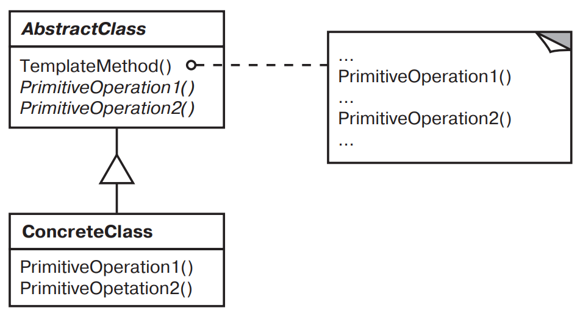

[Паттерны](../../Patterns.md)

# Template Method

tags:

- #architecture
- #behavioral

**Назначение**: Шаблонный метод определяет основу алгоритма и позволяет подклассам переопределить некоторые шаги алгоритма, не изменяя его структуру в целом.

**Применимость**:

- Однократное использование инвариантных частей алгоритма, при этом реализация изменяющегося поведения остается на усмотрение подклассов.

- Необходимость вычленить и локализовать в одном классе поведение, общее для всех подклассов, чтобы избежать дублирование кода.  
  Сначала выявляются различия в существующем коде, которые затем выносятся в отдельные операции. В конечном итоге различающиеся фрагменты кода заменяются шаблонным методом, которого вызываются новые операции.

- Управление расширениями подклассов.  
  Шаблонный метод можно определить так, что он будет вызывать операции-зацепки (hooks).

**Структура**:


**Результаты**:

- Шаблонные методы - один из фундаментальных приемов повторного использования кода. Они предоставляют возможность вынести общее поведение в библиотечные классы.

- Шаблонные методы приводят к инвертированной структуре

- Шаблонные методы вызывают операции следующих видов.

  - Конкретные операции (либо из класса ConcreteClass, либо из классов клиента)
  - Конкретные операции из класса AbstractClass (то есть операции, полезные всем подклассам)
  - Примитивные операции (то есть абстрактные операции)
  - Фабричные методы
  - Операции зацепки (hooks), реализующие поведение по умолчанию которое может быть расширенно в подклассах. Часто такая операция по умолчанию не делает ничего.  
     Важно, чтобы в шаблонном методе четко различались операции зацепки (которые _можно_ замещать) и абстрактные операции (которые _нужно_ замещать). Чтобы повторно использовать абстрактный класс с максимальной эффективностью, авторы подклассов должны понимать, какие операции предназначены для замещения.  
     Подкласс может расширить поведение некоторой операции, заместив ее и явно вызвав эту операцию из родительского класса:

    ```
    void DerivedClass::Operation () {
      // Расширенное поведение DerivedClass
      ParentClass::Operation();
    }
    ```

    К сожалению, очень легко забыть о необходимости вызывать унаследованную операцию. Такую операцию можно трансформировать в шаблонный метод, чтобы предоставить родителю контроль над тем, как подклассы расширяют его. Идея в том, чтобы вызывать операцию-зацепку из шаблонного метода в родительском классе. Тогда подклассы смогут переопределить именно эту операцию:

    ```
    void ParentClass::Operation () {
      // Поведение ParentClass
      HookOperation();
    }
    ```

    В родительском классе ParentClass операция HookOperation не делает ничего:

    ```
    void ParentClass::HookOperation () { }
    ```

    Подклассы переопределяют HookOperation, чтобы расширить свое поведение:

    ```
    void DerivedClass::HookOperation () {
      // Расширение в производном классе
    }
    ```

**Реализация**:

<details>
<summary>Code Example</summary>

```js
class View {
	setFocus() {}
	doDisplay() {
		// операция не делает ничего
	}
	resetFocus() {}
}

class MyView {
	doDisplay() {
		// изобразить содержимое View
	}
}
```

</details>
