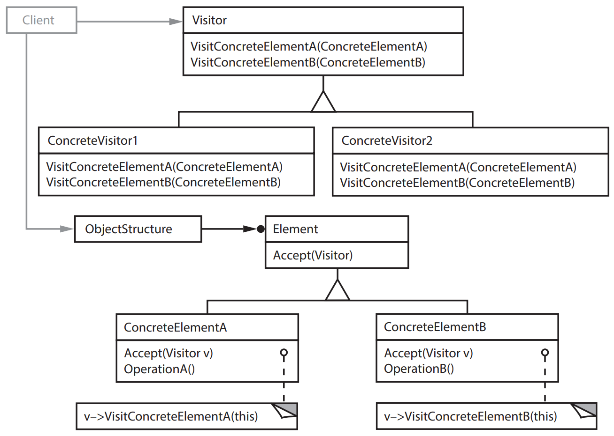
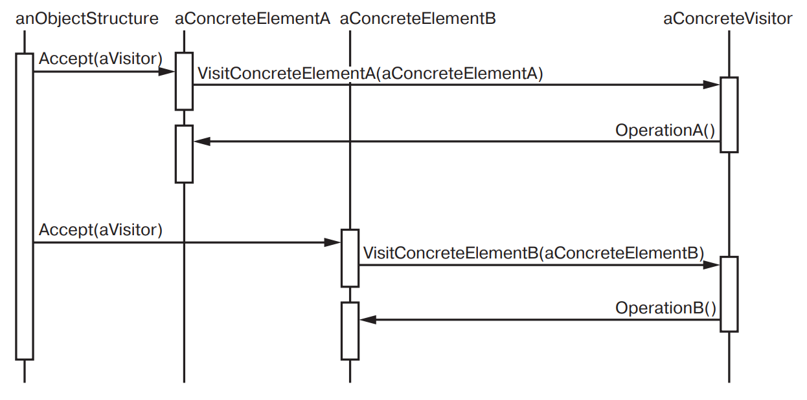

[Паттерны](../../Patterns.md)

tags:

- #architecture
- #behavioral

**Назначение**: Описывает операцию, выполняемую с каждым объектом из некоторой структуры. Паттерн _Visitor_ позволяет определить новую операцию, не изменяя классы этих объектов.

**Применимость**:

- В структуре присутствуют объекты многих классов с различными интерфейсами, и вы хотите выполнять над ними операции, зависящие от конкретных классов;

- Над объектами, входящими в состав структуры, должны выполняться разнообразные, не связанные между собой операции и вы не хотите «засорять» классы такими операциями. Посетитель позволяет объединить родственные операции, поместив их в один класс. Если структура объектов является общей для нескольких приложений, то паттерн посетитель позволит в каждое приложение включить только относящиеся к нему операции;
- Классы, определяющие структуру объектов, изменяются редко, но новые операции над этой структурой добавляются часто. При изменении классов, представленных в структуре, придется переопределить интерфейсы всех посетителей, а это может вызвать затруднения. Поэтому если классы меняются достаточно часто, то, вероятно, лучше определить операции прямо в них.

**Структура**:



**Результаты**:

**Реализация**:

<details>
 <summary>Code Example</summary>
 ```js
 ```
</details>
