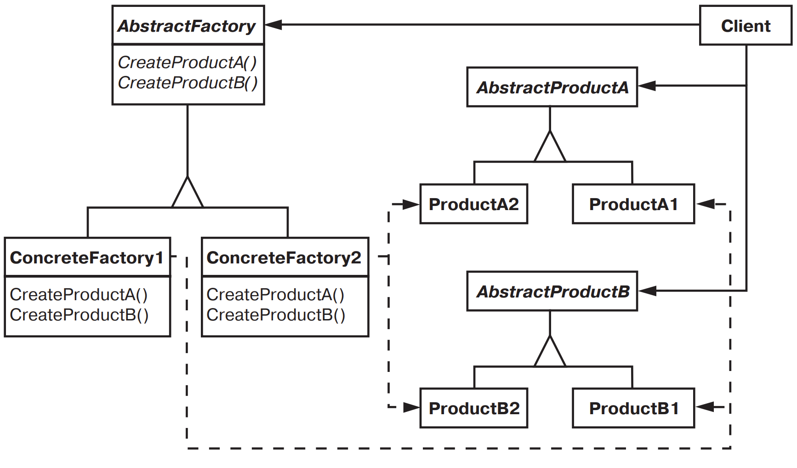

[Паттерны](../../Patterns.md)

tags:

- #programming/architecture
- #programming/patterns/creational

**Назначение**: Предоставляет интерфейс для создания семейств взаимосвязанных или взаимозависимых объектов, не специфицируя их конкретных классов

**Применимость**:

- система не должна зависеть от того, как создаются, компонуются и представляются входящие в нее объекты
- система должна настраиваться одним из семейств объектов (уровень игры, тема интерфейсов)
- входящие в семейство взаимо связанные объекты спроектированы для совместной работы, и вы должны обеспечить выполнение этого ограничения
- вы хотите предоставить библиотеку объектов, раскрывая только их интерфейсы, но не реализацию

**Структура**:


**Результаты**:

- скрывает от клиента конкретные классы продуктов, уменьшая тем самым число известных клиенту имен.
- упрощает замену семейств продуктов
- гарантирует сочетаемость продуктов
- не упрощает задачу поддержки продуктов

**Реализация**:

- _ConcreteFactory_ обычно нужны в единственном экземпляре, используйте _Singleton_
- Создание продуктов.
- Определение расширяемых фабрик.

<details>
 <summary>Code Example</summary>

```jsx
const mazeFactory = {
  makeMaze() {
    return new Maze();
  },
  makeWall() {
    return new Wall();
  },
  makeRoom(number) {
    return new Room(number);
  },
  makeDoor(room1, room2) {
    return new Door(room1, room2);
  },
};

const bombedMazeFactory = {
  ...mazeFactory,
  makeWall() {
    return new BombedWall();
  },
  makeRoom(number) {
    return new RoomWithBomb(number);
  },
};

const enchantedMazeFactory = {
  ...mazeFactory,
  makeRoom(number) {
    return new EnchantedRoom(number);
  },
  makeDoor(room1, room2) {
    return new DoorNeedingSpell(room1, room2);
  },
  spell: 'abracadabra',
};

const mazeGame = new MazeGame();

const bombedMaze = mazeGame.createMaze(bombedMazeFactory);
console.log(bombedMaze);

const enchantedMaze = mazeGame.createMaze(enchantedMazeFactory);
console.log(enchantedMaze);
```

</details>

<details>
 <summary>Doka</summary>

Абстрактная фабрика — это фабрика фабрик

**Абстрактная фабрика** не возвращает конкретный объект, вместо этого она **описывает тип объекта, который будет создан.**

```ts
class Violin implements Instrument {
  playNote(note) {
    console.log(`Играю ${note} на скрипке!`);
  }
}
class Cello implements Instrument {
  playNote(note) {
    console.log(`Играю ${note} на виолончели!`);
  }
}
interface Musician {
  play(piece: MusicPiece): void;
}
class Violinist implements Musician {
  private instrument: Instrument = new Violin();
  play = (piece) => piece.forEach((note) => this.instrument.playNote(note));
  // Играю A# на скрипке!
  // Играю C на скрипке!
}
class Cellist implements Musician {
  private instrument: Instrument = new Cello();
  play = (piece) => piece.forEach((note) => this.instrument.playNote(note));
  // Играю A# на виолончели!
  // Играю C на виолончели!
}
// Общий интерфейс:
interface ReservationFactory {
  reserveInstrument(): Instrument;
  notifyPlayer(): Musician;
}
// Реализации под разные инструменты:
class ViolinReservation implements ReservationFactory {
  reserveInstrument = () => new Violin();
  notifyPlayer = () => new Violinist();
}
class CelloReservation implements ReservationFactory {
  reserveInstrument = () => new Cello();
  notifyPlayer = () => new Cellist();
}
function reserve(reservation: ReservationFactory): void {
  reservation.notifyPlayer();
  reservation.reserveInstrument();
}
```

</details>
