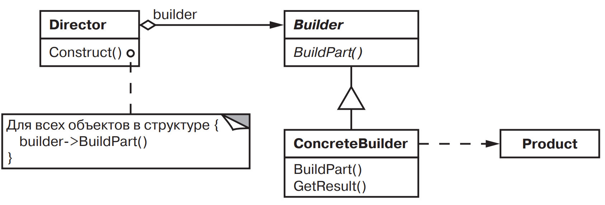

[Паттерны](../../Patterns.md)

tags:

- #architecture
- #creational

**Назначение**: Отделяет конструирование сложного объекта от его представления, так что в результате одного и того же процесса конструирования могут получаться разные представления.

**Применимость**:

- алгоритм создания сложного объекта не должен зависеть от того, из каких частей состоит объект и как они стыкуются между собой
- процесс конструирования должен обеспечивать различные представления конструируемого объекта

**Структура**:

**Результаты**:

- скрывает от клиента конкретные классы продуктов, уменьшая тем самым число известных клиенту имен.
- позволяет изменять внутренние представление продукта
- инкапсулирует код реализующий конструирование и представление
- предоставляет более точный контроль над процессом конструирования

**Реализация**:

- интерфейс сборки и конструирования - должен быть достаточно общим, чтобы обеспечить конструирование при любом виде конкретного строителя.

<details>
 <summary>Code Example</summary>

```js
class MazeBuilder {
	constructor() {}
	buildMaze() {
		throw new Error('MazeBuilder buildMaze is not implemented');
	}
	buildRoom(room) {
		throw new Error('MazeBuilder buildRoom is not implemented');
	}
	buildDoor(roomFrom, roomTo) {
		throw new Error('MazeBuilder buildDoor is not implemented');
	}
	getMaze() {
		throw new Error('MazeBuilder getMaze is not implemented');
	}
}

export class StandartMazeBuilder extends MazeBuilder {
	constructor() {
		super();
		this.maze = null;
	}

	buildMaze() {
		this.maze = new Maze();
	}
	buildRoom(roomNum) {
		if (this.maze.roomNo(roomNum)) {
			const room = new Room(room);
			this.maze.addRoom(room);

			room.setSide(direction.north, new Wall());
			room.setSide(direction.south, new Wall());
			room.setSide(direction.east, new Wall());
			room.setSide(direction.west, new Wall());
		}
	}
	buildDoor(roomFrom, roomTo) {
		if (!this.maze.roomNo(roomFrom)) {
			throw new Error(`room:${roomFrom} is not Exist`);
		}
		if (!this.maze.roomNo(roomTo)) {
			throw new Error(`room:${roomTo} is not Exist`);
		}

		const r1 = this.maze.getRoom(roomFrom);
		const r2 = this.maze.getRoom(roomTo);

		const door = new Door(r1, r2);
		r1.setSide(direction.east, door);
		r2.setSide(direction.west, door);
	}
	getMaze() {
		return this.maze;
	}
}

export class CountingMazeBuilder extends MazeBuilder {
	constructor() {
		super();
		this.rooms = 0;
		this.doors = 0;
	}

	buildMaze() {
		this.maze = new Maze();
	}
	buildRoom(roomNum) {
		this.rooms++;
	}
	buildDoor(roomFrom, roomTo) {
		this.doors++;
	}
	getMaze() {
		return this.maze;
	}

	getCounts() {
		return { rooms: this.rooms, doors: this.doors };
	}
}

const game = new MazeGame();

const maze = game.createMaze(new StandartMazeBuilder());
console.log(maze);
const countingMazeBuilder = new CountingMazeBuilder();
const countingMaze = game.createMaze(countingMazeBuilder);
console.log(
	`В лабиринте есть ${countingMazeBuilder.rooms} ` +
		`комнат и ${countingMazeBuilder.doors} дверей`,
);
```

<details>
 <summary>doka</summary>

Cтроитель — позволяет создавать объекты, добавляя им свойства по заданным правилам.
**Когда использовать**

- при создании объекта нужно выполнить много шагов, часть из которых могут быть необязательными.

```ts
class DrinkBuilder {
	settings = {
		base: 'espresso',
	};
	addMilk = () => {
		this.settings.milk = true;
		return this;
	};
	addSugar = () => {
		this.settings.sugar = true;
		return this;
	};
	addCream = () => {
		this.settings.cream = true;
		return this;
	};
	addSyrup = () => {
		this.settings.syrup = true;
		return this;
	};
	build = () => new Drink(this.settings);
}
```

</details>
