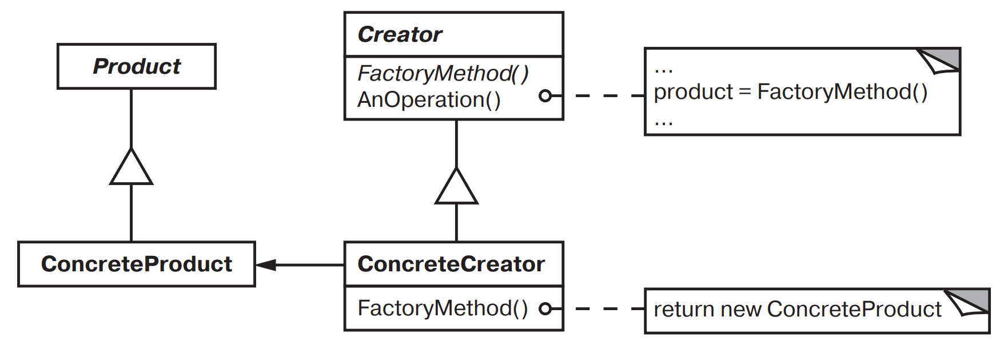

[Паттерны](../../Patterns.md)

tags:

- #programming/architecture
- #programming/patterns/creational

**Назначение**: Определяет интерфейс для создания объекта, но оставляет подклассам решение о том, экземпляры какого класса должны создаваться.
_Factory Method_ позволяет классу делегировать создание экземпляров подклассам

**Применимость**:

- Классу заранее неизвестно, объекты каких классов ему нужно создавать
- Класс спроектирован так, чтобы объекты, которые он создает, определялись подклассами
- Класс делегирует свои обязанности одному из нескольких вспомогательных подклассов, и вам нужно локализовать информацию о том, какой класс принимает эти обязанности на себя

**Структура**:


**Результаты**:

- избавляет от необходимости встраивать в код зависящие от приложения классы
- подклассам предоставляются оперции-зацепки(hooks)
- соединение параллельных иерархий

минусы:

- Клиенту возможно придется создавать подкласс класса _Creator_ для создания лишь одного объекта _ConcreteProduct_

**Реализация**:

- две основных:
- _Creator_ - абстрактный класс, не реализует _FactoryMethod_.
- _Creator_ - конкретный класс, реализован _FactoryMethod_.
- параметризованные _Factory_.

### Code Example

```jsx
class MazeGame {
  createMaze() {
    const maze = this.makeMaze();

    const room1 = this.makeRoom(1);
    const room2 = this.makeRoom(2);

    const door = this.makeDoor(room1, room2);

    maze.addRoom(room1);
    maze.addRoom(room2);

    room1.setSide(direction.north, this.makeWall());
    room1.setSide(direction.east, door);
    room1.setSide(direction.south, this.makeWall());
    room1.setSide(direction.west, this.makeWall());

    room2.setSide(direction.north, this.makeWall());
    room2.setSide(direction.east, this.makeWall());
    room2.setSide(direction.south, this.makeWall());
    room2.setSide(direction.west, door);

    return maze;
  }

  // Factory methods
  makeMaze() {
    return new Maze();
  }
  makeRoom(roomNumber) {
    return new Room(roomNumber);
  }
  makeWall() {
    return new Wall();
  }
  makeDoor(room1, room2) {
    return new Door(room1, room2);
  }
}

class BombedMazeGame extends MazeGame {
  constructor() {
    super();
  }

  makeWall() {
    return new BombedWall();
  }
  makeRoom(roomNumber) {
    return new RoomWithBomb(roomNumber);
  }
}

class EnchantedMazeGame extends MazeGame {
  constructor() {
    super();
  }

  makeRoom(roomNumber) {
    return new EnchantedRoom(roomNumber);
  }
  makeDoor(room1, room2) {
    return new DoorNeedingSpell(room1, room2);
  }
}

const game = new MazeGame();
const maze = game.createMaze();
console.log(maze);

const bombedGame = new BombedMazeGame();
const bombedMaze = game.createMaze();
console.log(bombedMaze);

const enchantedGame = new EnchantedMazeGame();
const enchantedMaze = game.createMaze();
console.log(enchantedMaze);
```

### doka

**Когда использовать**

- если создание объекта сложнее, чем 1–2 строки кода.
- требуется применить расчёты
- требуется получить дополнительные данные

```jsx
const sixStringsGuitar = createGuitar(6);
const sevenStringsGuitar = createGuitar(7);

function createGuitar(stringsCount = 6) {
  return new Guitar({
    strings: stringsCount,
    frets: 24,
    fretBoardMaterial: 'пихта',
    boardMaterial: 'клён',
  });
}
```
