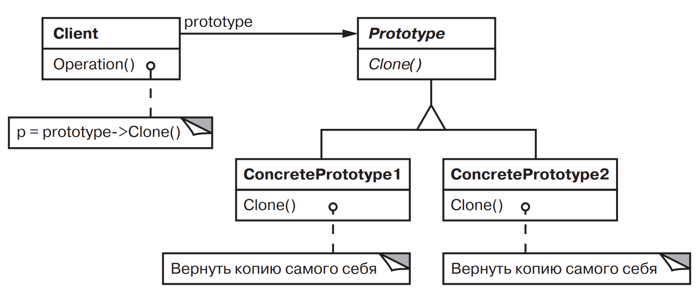

[Паттерны](../../Patterns.md)

tags:

- #programming/architecture
- #programming/patterns/creational

**Назначение**: Задает виды создаваемых объектов с помощью экземпляра-прототипа и создает новые объекты путем копирования этого прототипа

**Применимость**:

- система не должна зависеть от того, как в ней создаются, компонуются и представляются продукты.
- классы для создания экземпляров определяются во время выполнения.
- для того чтобы избежать построения иерархий классов или фабрик, параллельных иерархии классов продуктов.
- экземпляры класса могут находится в одном из не очень большого числа различных состояний. Может быть удобнее установить соответствующее число прототипов и клонировать их, а не создавать экземпляр каждый раз вручную в подходящем состоянии.

**Структура**:



**Результаты**:

- скрывает от клиента конкретные классы продуктов, уменьшая тем самым число известных клиенту имен.
- добавление и удаление продуктов во время выполнения
- определение новых объектов путем изменения структуры
- уменьшение числа подклассов
- динамическая настройка коммуникации приложения классами

**Реализация**:

- Если число прототипов в системе не фиксированно используйте диспетчер прототипов
- Релизация _clone()_. обратите внимаение на глубокое и поверхностное копирование объекта
- иногда необходимо инициализировать объект

<details>
 <summary>Code Example</summary>

```jsx
class MazeGame {
  createMaze(factory) {
    console.log('createMaze(factory)');

    const maze = factory.makeMaze();

    const r1 = factory.makeRoom(1);
    const r2 = factory.makeRoom(2);
    const r1r2door = factory.makeDoor(r1, r2);

    maze.addRoom(r1);
    maze.addRoom(r2);

    r1.setSide(direction.north, factory.makeWall());
    r1.setSide(direction.east, r1r2door);
    r1.setSide(direction.south, factory.makeWall());
    r1.setSide(direction.west, factory.makeWall());

    r2.setSide(direction.north, factory.makeWall());
    r2.setSide(direction.east, factory.makeWall());
    r2.setSide(direction.south, factory.makeWall());
    r2.setSide(direction.west, r1r2door);

    return maze;
  }
}

class Room extends MapSite {
  constructor(roomNumber = 0) {
    super();
    this.roomNumber = roomNumber;
    this.sides = { north: null, south: null, east: null, west: null };
  }
  setSide(direction, mapSite) {
    this.sides[direction] = mapSite;
  }
  getSide(direction) {
    return this.sides[direction];
  }
  enter() {
    console.log(`enter room: ${this.roomNumber}`);
  }
  clone() {
    const newRoom = new Room();
    newRoom.roomNumber = this.roomNumber;
    newRoom.sides = this.sides;
    return newRoom;
  }
  initialize(roomNumber) {
    this.roomNumber = roomNumber;
  }
}
class Maze {
  constructor() {
    this.rooms = new Map();
  }
  addRoom(room) {
    this.rooms.set(room.roomNumber, room);
  }
  getRoom(roomNumber) {
    return this.rooms.get(roomNumber);
  }
  clone() {
    return new Maze();
  }
}
class Wall extends MapSite {
  constructor() {
    super();
  }
  enter() {
    console.log("You can't enter the wall");
  }
  clone() {
    return new Wall();
  }
}

class Door {
  constructor(room1, room2) {
    this.room1 = room1;
    this.room2 = room2;
    this.isOpen = false;
  }
  setRooms(room1, room2) {
    this.room1 = room1;
    this.room2 = room2;
  }

  enter() {
    if (this.isOpen) {
      console.log(`enter room: ${this.room2.roomNumber}`);
    } else {
      console.log('your nose is broken');
    }
  }
  clone() {
    const newDoor = new Door();
    newDoor.room1 = this.room1;
    newDoor.room2 = this.room2;
    newDoor.isOpen = this.isOpen;
    return newDoor;
  }
  initialize(room1, room2) {
    this.room1 = room1;
    this.room2 = room2;
  }
}

const game = new MazeGame();
const simpleMazeFactory = new MazePrototypeFactory(
  new Maze(),
  new Wall(),
  new Room(),
  new Door(),
);
const maze = game.createMaze(simpleMazeFactory);
console.log(maze);

const bombedMazeFactory = new MazePrototypeFactory(
  new Maze(),
  new BombedWall(),
  new RoomWithBomb(),
  new Door(),
);
const bombedMaze = game.createMaze(bombedMazeFactory);
console.log(bombedMaze);
```

</details>
