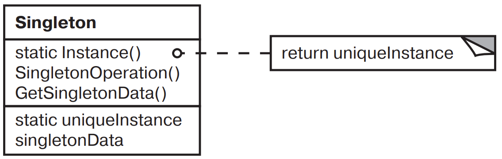

[Паттерны](../../Patterns.md)

# Singleton

tags:

- #architecture
- #creational

**Назначение**: Гарантирует что у класса существует только один экземпляр, и предоставляет к нему глобальную точку доступа.

**Применимость**:

- Должен существовать ровно один экземпляр некоторого класса, к которому может обратиться любой клиент через известную точку доступа.
- Единственный экземпляр должен расширяться путем порождения подклассов, а клиенты должны иметь возможность работать с расширенным экземпляром без модификации своего кода.

**Структура**:


**Результаты**:

- Контролируемый доступ к единственному экземпляру.
- Сокращение пространства имен.
- Возможность уточнения операций и представления.
- Возможность использования переменного числа экземпляров.
- Большая гибкость, чем у операций класса.

**Реализация**:

- Гарантии существования единственного экземпляра.
- Порождение подклассов Singleton.

### Code Example

```jsx
class MazeFactory {
	instance = null;
	static Instance() {
		if (MazeFactory.instance === null) {
			MazeFactory.instance = new MazeFactory();
			return MazeFactory.instance;
		}

		return MazeFactory.instance;
	}
}
```
