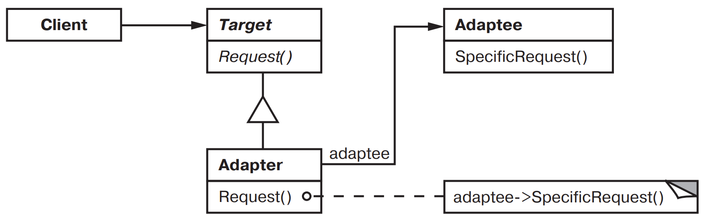
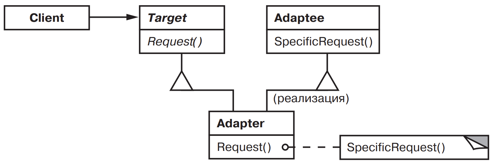
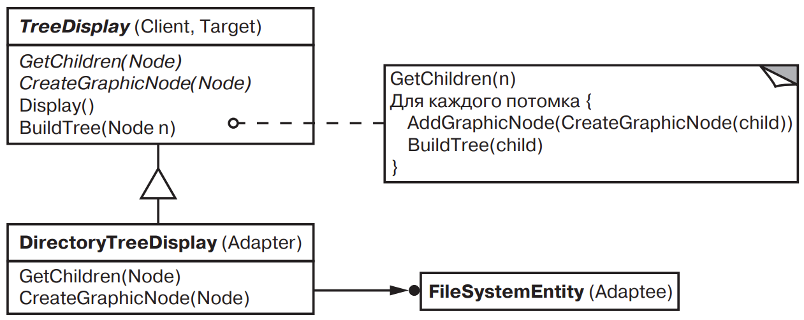
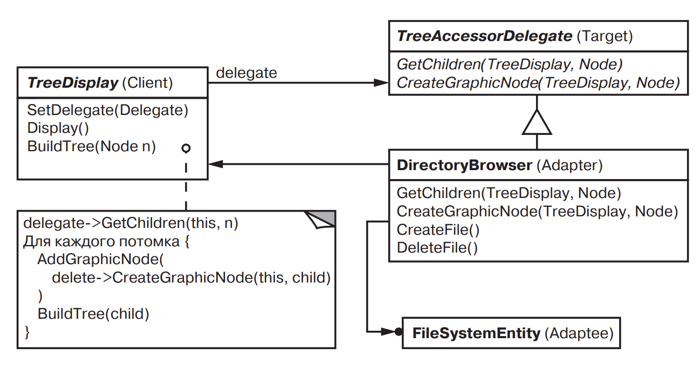

[Паттерны](../../Patterns.md)
tags:

- #programming/architecture
- #programming/patterns/structural

**Другие имена**: Wrapper

**Назначение**: Преобразует интерфейс одного класса в другой интерфейс, на который рассчитаны клиенты. Адаптер обеспечивает совместную работу классов с несовместимыми интерфейсами, которая без него была бы невозможна

**Применимость**:

- Вы хотите использовать существующий класс, но его интерфейс не соответствует вашим потребностям
- требуется создатьповторно используемый класс, который должен взаимодействовать с заранее неизвестными или не связанными с ним классами имеющими несовместимые интерфейсы

для адаптера объектов:

- Нужно использовать несколько существующих подклассов, но непрактично адаптировать их интерфейсы путем порождения новых подклассов от каждого. В этом случае адаптер объектов может приспосабливать интерфейс их общего родительского класса.

**Структура**:


<details>
  <summary>Адаптер Класса</summary>
  
  использует множественное наследование для адаптации одного интерфейса к другому.
  
</details>

**Результаты**:

- Позволяет одному адаптеру _Adapter_ работать со многими адаптируемыми объектами _Adaptee_, то есть с самим _Adaptee_ и его подклассами. Адаптер может добавить новую функциональность сразу всем адаптируемым объектам.
- Затрудняет замещение операций класса _Adaptee_. Для этого потребуется породить от _Adaptee_ подкласс и заставить _Adapter_ ссылаться на этот подкласс, а не на сам _Adaptee_.

  **Адаптер Класса**:

  - Адаптирует _Adaptee_ к _Target_, перепоручая действия конкретному классу _Adaptee_. Поэтому данный паттерн не будет работать, если мы захотим одновременно адаптировать класс и его подклассы
  - Позволяет Адаптеру _Adapter_ заместить некоторые операции адаптируемого класса _Adaptee_, так как _Adapter_ есть ни что иное как подкласс _Adaptee_.
  - Вводит только один новый объект. Чтобы добраться до адаптируемого класса, не нужно никакого дополнительного общения по указателю.

- Адаптеры сильно отличаются по объему работы. Это может быть простейшее преобразование (например, изменения имен операций), так и поддержка совершенно другого набора операций.
- _Сменные адаптеры_.
- Использование двусторонних адаптеров для обеспечения прозрачности. Адаптированный объект уже не обладает интерфейсом _Adaptee_, так что его нельзя использовать там где _Adaptee_ был применим

**Реализация**:

- сменные адаптеры. Три способа реализации сменных адаптеров для виджета TreeDisplay, который может автоматически отображать иерархические структуры.
  Первый шаг, поиск "узкого" интерфейса для _Adaptee_, то есть наименьшего подмножества операций, позволяющего выполнить адаптацию.

  - Использование абстрактных операций  
    Определим в классе _TreeDisplay_ абстрактные операции, которые соответствуют "узкому" интерфейсу класса _Adaptee_. Подклассы должны реализовывать эти абстрактные операции и адаптировать иерархические структурированный объект
    
  - Использование объектов делегатов  
    При таком подходе _TreeDisplay_ переадресует запросы на доступ к иерархической структуре объекту-делегату. _TreeDisplay_ может реализовывать различные стратегии адаптации, подставляя разных делегатов.
    

  - Параметризованные адаптеры

<details>
  <summary>Code Example</summary>
  
  ```js
  class Shape { // Target
    constructor() {}
    boundingBox(bottomLeftPoint, topRightPoint) {
      throw new Error('Shape.boundingBox is not implemented');
    }
    createManipulator() {
      throw new Error('Shape.createManipulator is not implemented');
    }
  }
  class TextView { // Adaptee
    constructor() {
      this.x = 1;
      this.y = 2;
      this.width = 3;
      this.height = 4;
    }
    getOrigin() {
      return { x: this.x, y: this.y };
    }
    getExtent() {
      return { width: this.width, height: this.height };
    }
    isEmpty() {
      return this.width === 0 || this.height === 0;
    }
  }
  class TextShape extends Shape { // Adapter
    constructor(textView) {
    super();
    this.textView = textView;
    }
    boundingBox() {
    const { x: bottom, y: left } = this.textView.getOrigin();
    const { width, height } = this.textView.getExtent();
        return {
          bottomLeft: new Point(bottom, left),
          topRight: new Point(bottom + height, left + width),
        };
    }
    createManipulator() {
    return new TextManipulator();
    }
  }
  ```

</details>

<details>
<summary>Doka</summary>
Адаптер — помогает сделать не совместимое API совместимым и использовать его.

```js
// Преобразует из snake_case в camelCase
function responseToWantedAdapter(response) {
  return response.entries.map((entry) => ({
    userName: entry.user_name,
    email: entry.email_address,
    id: entry.ID,
  }));
}
```

</details>
````
