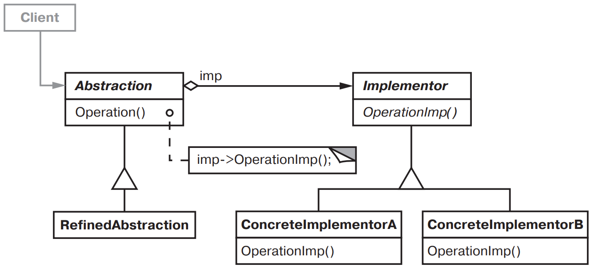
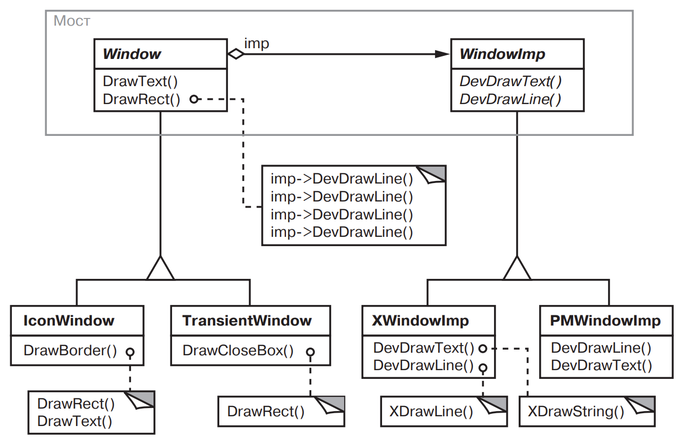

[Паттерны](../../Patterns.md)

# Bridge

tags:

- #architecture
- #structural

**Назначение**: Отделить абстракцию от ее реализации так, чтобы то и другое можно было изменять независимо

**Применимость**:

- Требуется избежать постоянной привязки абстракции к реализации. (прим: реализация должна выбираться во время исполнения программы)

- И абстракции и реализации должны расширяться новыми подклассами.

- Изменения в реализации абстракции не должны отражаться на клиентах.

- Число классов стремительно разрастается

- Реализация должна совместно использоваться несколькими объектами

**Структура**:


**Результаты**:

- Отделение реализации от интерфейса. Облегчает разделение системы на слои.

- Повышение степени расширяемости. Иерархии классов _Abstraction_ и _Implementor_ могут расширяться независимо.

- Сокрытие деталей реализации от клиентов.

**Реализация**:

<details>

<summary>Code Example</summary>

```js
```

</details>
