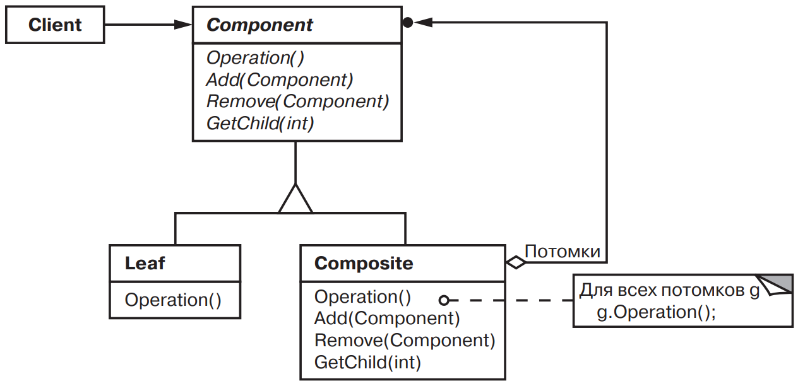

[Паттерны](../../Patterns.md)

tags:

- #programming/architecture
- #programming/patterns/structural

**Назначение**: Компонует объекты в древовидные структуры для представления иерархий "часть – целое". Позволяет клиентам единообразно трактовать индивидуальные и составные объекты.

**Применимость**:

- Требуется представить иерархию объектов вида "часть – целое".

- Клиенты должны по единым правилам работать с составными и индивидуальными объектами.

**Структура**:



**Результаты**:

- Определяет иерархии классов, состоящие из примитивных и составных объектов.

- Клиенты могут единообразно работать с иднивидуальными объектами и с составными структурами.

- Облегчает добавление новых видов компонентов.

- Трудно установить ограничения на то, какие элементы могут быть добавлены.

**Реализация**:

<details>
 <summary>Code Example</summary>
 
 ```js
 class Equipment {
  constructor(name) {
    this.name = name;
  }
  
  power() {}
  netPrice() {}
  discontPrice() {}
  
  add() {}
  remove() {}
}
  
class FloppyDisk extends Equipment {
  constructor(name, power, price) {
    super(name);
    this.price = price;
    this.power = power;
  }
  
  power() {
    return this.power;
  }
  netPrice() {
    return this.price;
  }
  discontPrice() {
    return this.price * 0.9;
  }
}
  
class CompositeEquipment extends Equipment {
  constructor(name) {
    super();
    this.equipment = new Set();
  }
  
  power() {}
  netPrice() {
    let total = 0;
    this.equipment.forEach((el) => {
      total += el.netPrice();
    });
  
    return total;
  }
  discontPrice() {
    return this.netPrice() * 0.9;
  }
  
  add(equipment) {
    this.equipment.add(equipment);
  }
  remove(equipment) {
    this.equipment.delete(equipment);
  }
}
  
class Chassis extends CompositeEquipment {
  constructor(name) {
    super(name);
  }
}
  
class Cabinet extends CompositeEquipment {
  // корпус
  constructor(name) {
    super(name);
  }
}
  
class Bus extends Equipment {
  constructor(name, price) {
    super(name);
    this.price = price;
  }
}
  
class Card extends Equipment {
  constructor(name, price) {
    super(name);
    this.price = price;
  }
}
  
const cabinet = new Cabinet('PC Cabinet');
const chassis = new Chassis('PC Chassis');
  
cabinet.add(chassis);
  
const bus = new Bus('MCA Bus');
bus.add(new Card('16Mbs Token Ring'));
  
chassis.add(bus);
chassis.add(new FloppyDisk('3.5in Floppy'));
  
console.log('The net prise is', chassis.netPrice());
  
 ```
</details>
