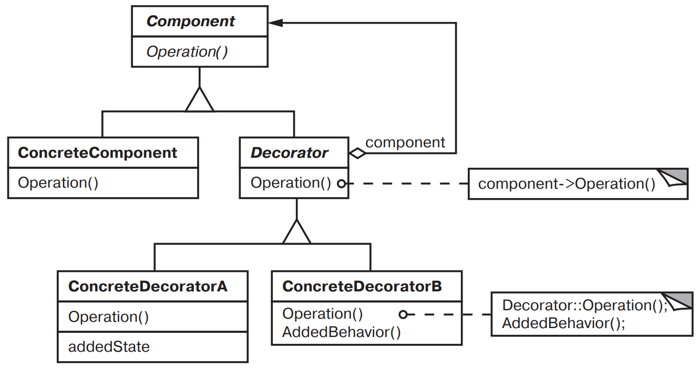

[Паттерны](../../Patterns.md)

tags:

- #architecture
- #structural

**Назначение**: Динамически добавляет объекту новые обязанности. Является гибкой альтернативой порождению классов с целью расширения функциональности.

**Применимость**:

- Динамическое, прозрачное для клиентов добавление обязанностей объектам

- Реализация обязанностей, которые согут быть сняты с объекта

- Расширение путем порождения классов недоступно/неудобно.  
  _Порождение подклассов для поддержки всех возможных комбинаций приведет к стремительному росту их числа._

**Структура**:


**Результаты**:

- Бо́льшая гибкость, чем у статического наследования.  
  Применение нескольких декораторов к одному компоненту позволяет формировать произвольные комбинации обязанностей

- Позваоляет избежать перегруженных функциями классов на верхних уровнях иерархии.  
  Вместо того чтобы поддержать все мыслимые возможности в одном сложном, допускающем разносторонюю настройку, классе, вы можете определить простой класс и постепенно наращивать его функциональность с помощью декораторов. В результате приложение уже не перегружвется используемыми функциями.

- Декоратор и его компонент не идентичны. Декоратор действует как прозрачное обрамление. Но декорированный компонент все же не идентичен исходному.

- Множество мелких объектов. При использовании _Decorator_ часто формируется система, составленная из большого числа мелких объектов, похожих друг на друга. Такие объекты различаются только способом взаимосвязи, а не классом и не значениями своих внутренних переменных. Хотя такие системы легко настраиваются проектировщиком, хорошо разбирающемся в их строении, изучать и отлаживать их очень тяжело.

**Реализация**:

<details>
<summary>Code Example</summary>

```js
class VisualComponent {
  constructor() {}
  draw() {}
  resize() {}
  // ...
}

class Decorator extends VisualComponent {
  constructor(component) {
    super();
    this.component = component;
  }

  draw() {
    this.component.draw();
  }
  resize() {
    this.component.resize();
  }
}

class BorderedDecorator extends Decorator {
  constructor(component, width) {
    super(component);
    this.width = width;
  }

  drawBorder(width) {}

  draw() {
    this.component.draw();
    this.drawBorder(this.width);
  }
}

class ScrollDecorator extends Decorator {}
class DropShadowDecorator extends Decorator {}

// Usage (Compose)

class Window {
  // ...
  setContents(component) {}
  // ...
}
class TextView extends VisualComponent {
  constructor() {
    super();
  }
}

const window = new Window();
const textView = new TextView();

// default
window.setContents(textView);

// with Scroll and Border
window.setContents(new BorderedDecorator(new ScrollDecorator(textView), 1));
```

</details>
