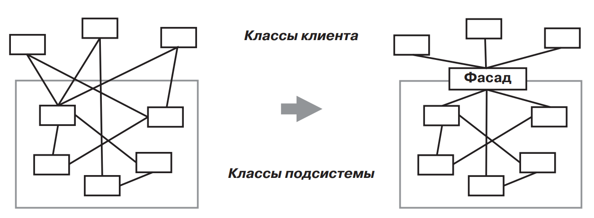
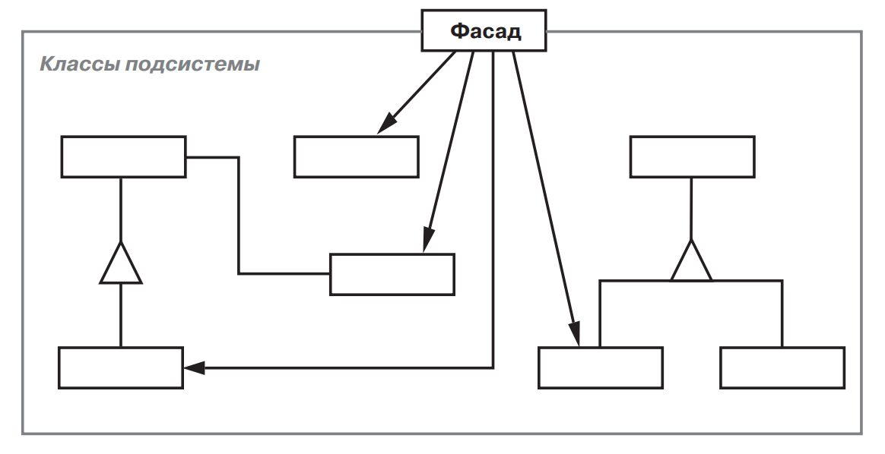

[Паттерны](../../Patterns.md)

tags:

- #architecture
- #structural
- #coupling

**Назначение**: Предоставляет унифицированный интерфейс вместо набора интерфейсов некоторой подсистемы. _Facade_ определяет интерфейс более высокого уровня, который упрощает использование подсистемы.


**Применимость**:

- Предоставление простого интерфейса к сложной подсистеме.  
  _Facade_ предлагает некоторый вид системы по умолчанию, устраивающий большинство клиентов. И лишь те клиенты, которым нужны более широкие возможности настройки, могут напрямую обратиться к тому, что находится за фасадом.

- Требуется разложить подсистему на отдельные уровни. Используюйте _Facade_ для определения точки входа на каждый уровень подсистемы. Если подсистемы зависят друг от друга, то зависимости можно упростить, разрешив подсистемам обмениваться информацией только через фасады.

- Многочисленные зависимости между клиентами и классами реализации абстракции.

**Структура**:


**Результаты**:

- Изолирует клиентов от компонентов подсистемы, упрощая число объектов, с которыми клиентам приходится взаимодействовать и упрощая работу с подсистемой.

- Ослабляет связанность(coupling) между подсистемой и ее клиентами. Слабая связанность позволяет видоизменять компоненты, не затрагивая при этом клиентов.

- Фасад не препятствует приложениям напрямую общаться к классам подсистемы если это необходимо. Таким образом, у вас есть выбор между простотой и общностью.

**Реализация**:

- Ослабление связанности клиента с подсистемой.  
  Степень связанности можно значительно уменьшить если сделать класс _Facade_ абстрактным. Его конкретные подклассы будут соответствовать различнымреализациям подсистемы. Тогда клиенты смогут взаимодействовать с подсистемой через интерфейс абстрактного класса _Facade_. Вместо порождения подклассов можно сконфигурировать объект _Facade_ различными объектами подсистем. Для настройки фасада достаточно заменить один или несколькотаких объектов.

- Открытые и закрытые классы подсистем.  
  Класс инкапсулирует состояние и оперции, а подсистема - классы. Открытый интерфейс подсистемы состоит из классов, к которым имеют доступ все клиенты; закрытый интерфейс доступен только для расширения подсистемы.

<details>
 <summary>Code Example</summary>

```js
class Scanner {
	constructor(inputStream) {
		this.inputStream = inputStream;
	}

	scan() {}
}

class Parser {
	constructor() {}
	parse(scanner, programNodeBuilder) {}
}

// Builder
class ProgramNodeBuilder {
	constructor() {
		this.node;
	}

	newVariable(variableName) {}
	newAssignment(variable, expression) {}
	newReturnStatement(value) {}
	newCondition(condition, truePart, falsePart) {}

	getRootNode() {}
}

// Composite
class ProgramNode {
	constructor() {}

	// операции с узлом программы
	getSourcePosition(line, index) {}
	// ...

	// операции с потомками
	add(node) {}
	remove(node) {}
	// ...

	traverse(codeGenerator) {}
}
class StatementNode {}
class ExpressionNode {}

// Visitor
class CodeGenerator {
	constructor(bytecodeStream) {
		this.output = bytecodeStream;
	}
	visit(node) {
		if (node instanceof StatementNode) {
			return;
		}
		if (node instanceof ExpressionNode) {
			return;
		}
	}
}

class StackMachineCodeGenerator extends CodeGenerator {}
class RISCCodeGenerator extends CodeGenerator {
	constructor(bytecodeStream) {
		super(bytecodeStream);
	}
}

// Facade
class Compiler {
	constructor() {}

	compile(inputStream, outputStream) {
		this.scanner = new Scanner(inputStream);

		this.builder = new ProgramNodeBuilder();

		this.parser = new Parser();
		this.parser.parse(this.scanner, this.builder);

		this.generator = new RISCCodeGenerator(outputStream);
		const parseTree = this.builder.getRootNode();
		parseTree.traverse(this.generator);
	}
}
```

</details>
