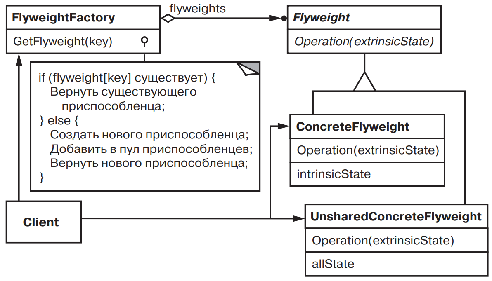
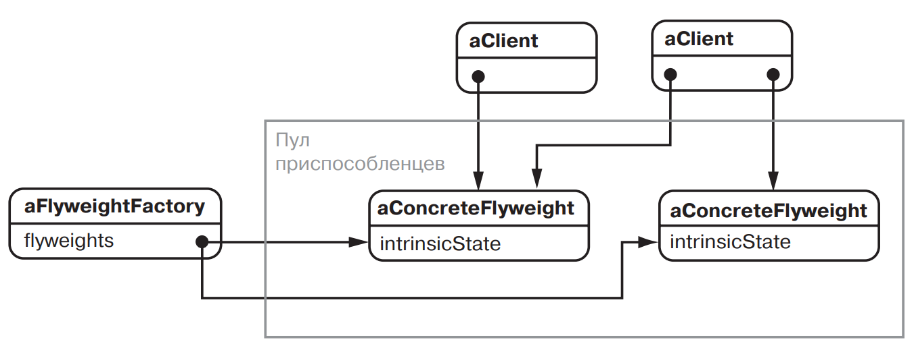

[Паттерны](../../Patterns.md)

tags:

- #architecture
- #structural

**Назначение**: Применяет совместное использование для эффективной поддержки множества мелких объектов.

**Применимость**: когда выполнены все ниже перечисленные условия:

- В приложении используется большое число объектов.
- Из-за этого затраты на хранение высоки.
- Большую часть состояния объектов можно вывести вовне.
- Многие группы относительно небольшим количеством совместно используемых объектов, поскольку внешнее состояние вынесено.
- Приложение не зависит от идентичности объекта. Поскольку объекты приспособленцы могут использоваться совместно, то проверка на идентичность возвратит признак истинности для концептуально различных объектов.

**Структура**:



**Результаты**:

**Реализация**:
лучше посмотри [ссылка](https://www.patterns.dev/vanilla/flyweight-pattern)

<details>
 <summary>Code Example</summary>
 ```js
 ```
</details>
