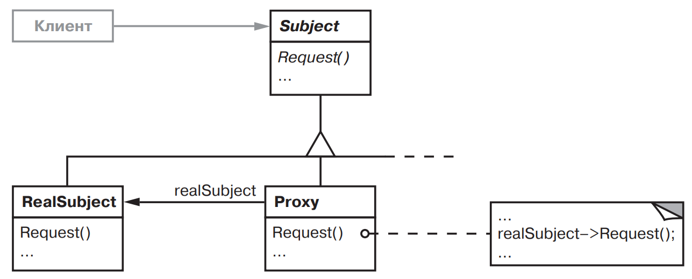
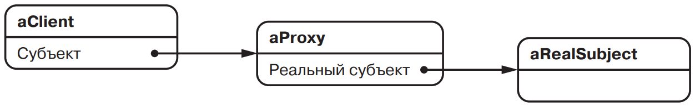

[Паттерны](../../Patterns.md)

# Proxy

tags:

- #architecture
- #structural

**Назначение**: Является суррогатом другого объекта и контролирует доступ к нему.

**Применимость**:

- Необходимо сослаться на объект более гибким или нетривиальным способом, чем при использовании указателя(ссылки)

- Remote Proxy предоставляет локального представителя для объекта находящегося в другом адресном пространстве.

- Virtual Proxy создает "тяжелые" объекты по необходимости.

- Proxy Defender контролирует доступ к исходному объекту. Полезен, когда для разных объектов определены различные права доступа.

- Умная ссылка - замена обычного указателя, позволяет выполнить дополнительные действия про доступе к объекту.

**Структура**:

Схема объектов для структуры с заместителем во время выполнения.


**Результаты**:

**Реализация**:

<details>
 <summary>Code Example</summary>
 ```js
 ```
</details>
