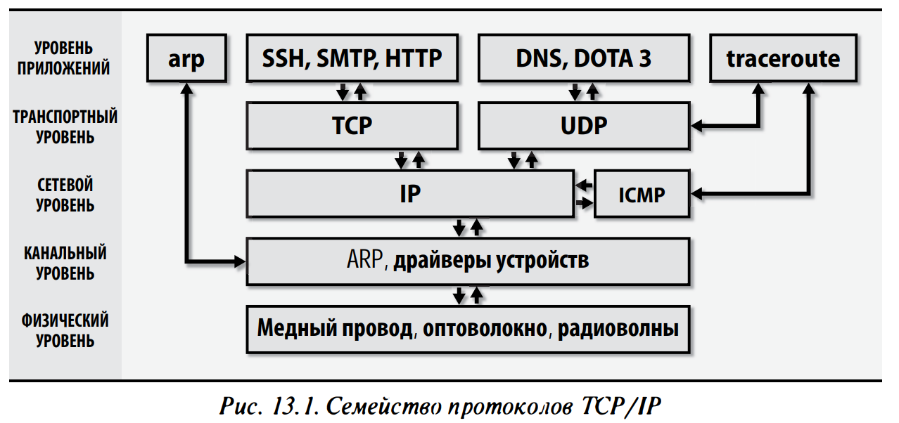

[Linux](./Linux.md)

# TCP/IP Сети

## Теория

Интернет представляет собой совокупность частных сетей, принадлежащих провайдерам интернет, которые соединяются в “точках обмена трафиком”(peering points)

- Сетевые стандарты и документация
  Request For Comments(RFC) — формат документов, в котором публикуются стандарты протоколов
  Документы RFC имеют порядковые номера
  Изменения и дополнения публикуются в виде новых документов с собственными номерами
  Дополнительные серии
  - FYI (For Your Information) — это вводные или информационные материалы, предназначенные для широкой аудитории. Как правило, именно с них лучше всего начинать изучать незнакомую тему.
  - BCP (Best Current Practice) — описывают рекомендуемые процедуры для администраторов вебсайтов в Интернете. Они содержат административные предписания и представляют большую ценность для системных администраторов.
  - STD (Standard) — содержат описания протоколов интернета, прошедших процедуру проверки и тестирования в I ETF и формально принятых в качестве стандартов.
    _TCP/IP_ — это семейство сетевых протоколов, ориентированных на совместную работу
    
- IP (Internet Protocol) — обеспечивает передачу пакетов данных с одного компьютера на другой (RFC791);
- ICMP (Internet Control Message Protocol) — протокол управляющих сообщений в Интернете отвечает за различные виды низкоуровневой поддержки протокола IP, включая сообщения об ошибках, вспомогательные маршрутизирующие запросы и отладочные сообщения (RFC792);
- ARP (Address Resolution Protocol) — обеспечивает трансляцию IР-адресов в аппаратные адреса (RFC826);
- UDP (User Datagram Protocol) — обеспечивает непроверяемую одностороннюю доставку данных (RFC768);
- ТСР (Transmission Control Protocol) протокол управления передачей обеспечивает надежный дуплексный канал связи между процессами на двух компьютерах с возможностью управления потоками и контроля ошибок (RFC793)
- IPv4  
  тк адресного пространства IPv4 не хватает на все устройства, используются следующие технологии для оптимизации адресного пространства
  - Protocol NAT(Network Address Translation) — Позволяет целым сетям машин скрываться за 1 IPv4 адресом
  - Технология CIDR(Classless Inter-Domain Routing) — гибко разделяет сети и способствует эффективной магистральной маршрутизации

### Пакеты и их инкапсуляция

Каждый уровень состоит из:

- Заголовка — откуда прибыл пакет, куда он направляется, контрольные суммы, информация характерная для протокола
- Полезная нагрузка — данные
  Готовящийся к отправке пакет передается вниз по стеку протоколов и каждый добавляет в него собственный заголовок
  
  Канальный уровень разделен на две части:
- MAC(Media Access Control) — работает с аудиовизуальной информацией и передает пакеты по проводам
- LLC(Link Layer Control) — формирует фреймы
  На канальном уровне к пакетам добавляются заголовки и между ними вставляются разделители
- заголовки — содержат информацию об адресах канального уровня и контрольные суммы
- разделители — помогают клиенту понять где заканчивается один пакет и начинается другой
  **Максимальный размер передаваемого блока**
  Размер сетевых пакетов ограничивается хар-ми аппаратных средств и протоколами
  MTU(Maximum Transfer Unit) — Максимальная единица передачи
  
