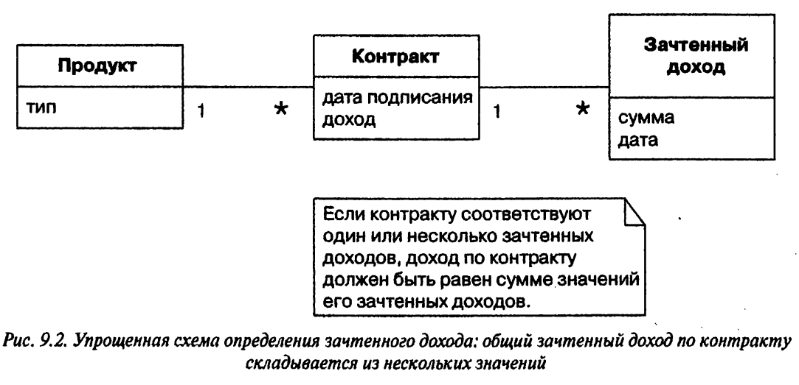

# Задача: Определение зачтенного дохода

Речь о том, когда и как именно следует учитывать доходы от продажи товаров и услуг

Пример(простой): Если я продаю вам чашку кофе, все просто: вы получаете продукт, я беру деньги и мгновенно фиксирую их в кассовом аппарате.

Пример(сложный): Предположим, вы платите мне гонорар за услуги, оказываемые на протяжении года. Каким бы образом плата ни вносилась(даже ежедневно), я, вероятно, смогу ее учесть в своих бухгалтерских книгах непосредственно, поскольку договор подписан на год. Можно, например, вести зачет, отображая 1/12 часть суммы в каждом месяце.

Правила определения зачтенного дохода многочисленны, разнообразны и нестабильны. Одни устанавливаются законом, другие регламентируются профессиональными стандартами, третьи вытекают из корпоративной политики.

Задача: Представим компанию, которая продает три типа программных продуктов.

- Текстовые процессоры  
  в соответствии с правилами при продаже текстового процессора следует учитывать сразу всю сумму;
- СУБД  
  схема зачета такова: треть суммы сегодня, треть по истечении 30 дней, треть - через 60 дней;
- Электронные таблицы  
  третья часть суммы может быть отображена в бухгалтерской отчетности в день продажи, вторая треть через 60 дней, оставшаяся через 90 дней.

