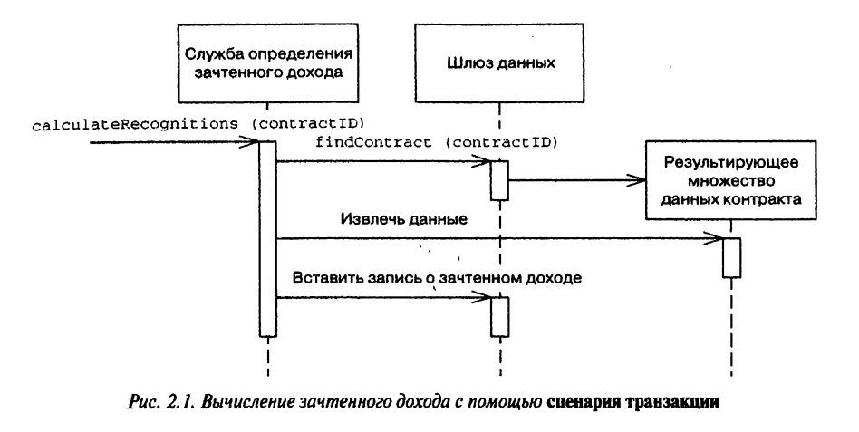

[PoEAA](../../PoEAA.md)

# Transaction Script

Transaction Script - Процедура, получает на вход информацию от слоя представления, обрабатывает ее, проводя необходимые проверки и вычисления, сохраняет в базе данных и активизирует операции других систем. Затем процедура возвращает слою представления определенные данные, возможно, осуществляя вспомогательные операции для форматирования содержимого результата

**Преимущества**:

- Представляет собой процедурную модель, легко воспринимаемую всеми разработчиками.
- Удачно сочетается с [Row Data Gateway](../../DataSource/RowDataGateway/RowDataGateway.md) и [Table Data Gateway](../../DataSource/TableDataGateway/TableDataGateway.md).
- Определяет четкие границы транзакции.

С возрастанием сложности бизнес-логики появляются недостатки:

- Если нескольким транзакциям необходимо осуществлять схожие функции, возникает дублирование кода.

