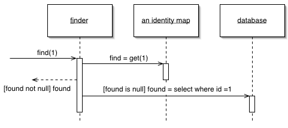

[PoEAA](../../PoEAA.md)

# Identity Map

Гарантирует, что каждый объект будет загружен из базы данных только один раз, сохраняя загруженный объект в специальной коллекции. При получении запроса просматривает коллекцию в поисках нужного объекта.

Паттерн Identity Map хранит в себе данные обо всех объектах, загруженных из базы данных в пределах одной бизнес транзакции.
