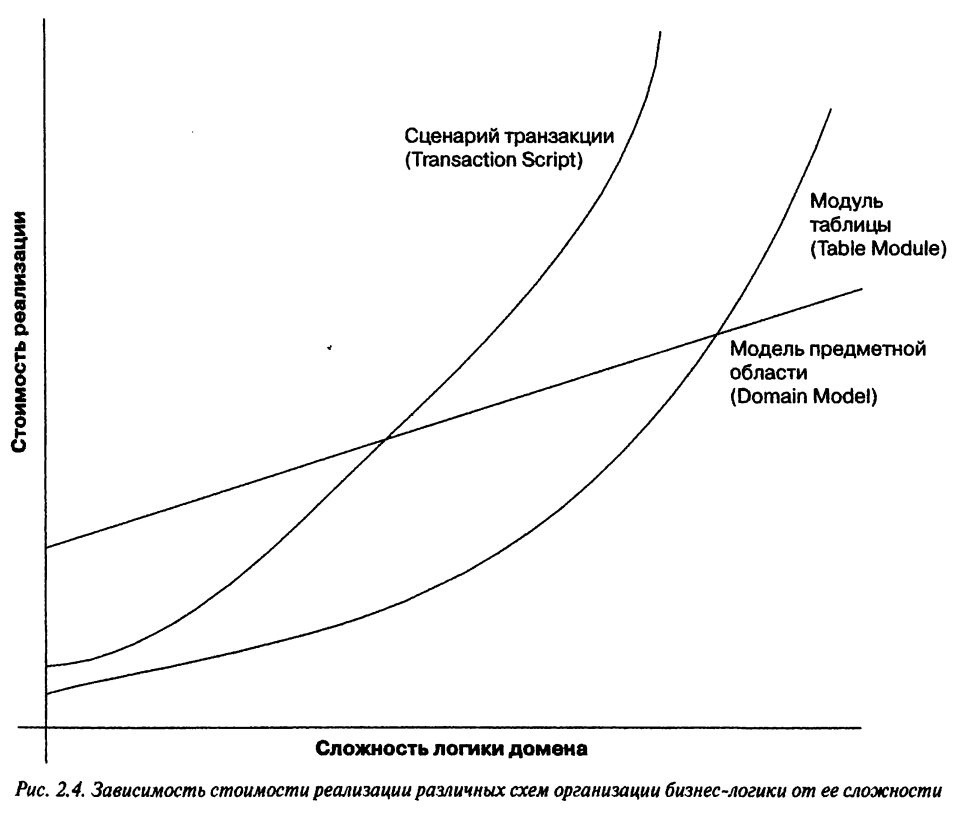

[База знаний](../README.md)

# Patterns of Enterprise Application Architecture

### Domain Logic

[Transaction Script](./DomainLogic/Transaction/Transaction.md)  
[Domain Model]()  
[Table Module]()  
[Service Layer]()

### Data Source

[Table Data Gateway](./ObjRelDataSource/TableDataGateway/TableDataGateway.md)  
[Row Data Gateway](./ObjRelDataSource/RowDataGateway/RowDataGateway.md)  
[Active Record](./ObjRelDataSource/ActiveRecord/ActiveRecord.md)  
[Data Mapper](./ObjRelDataSource/DataMapper/DataMapper.md)

### Object-Relational Behavioral Patterns

[Identity Map](./ObjRelBehavioral/IdentityMap/IdentityMap.md)

### Object-Relational Structural Patterns

[Identity Field]()
[Foreign Key Mapping]()
[Association Table Mapping]()
[Dependent Mapping]()
[Embedded Value]()
[Serialized LOB]()

### Object-Relational Metadata Mapping Patterns

[Metadata Mapping]()
[Query Object]()
[Repository]()

### Web Presentation Patterns

[Model View Controller]()
