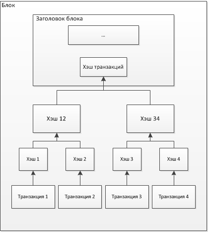
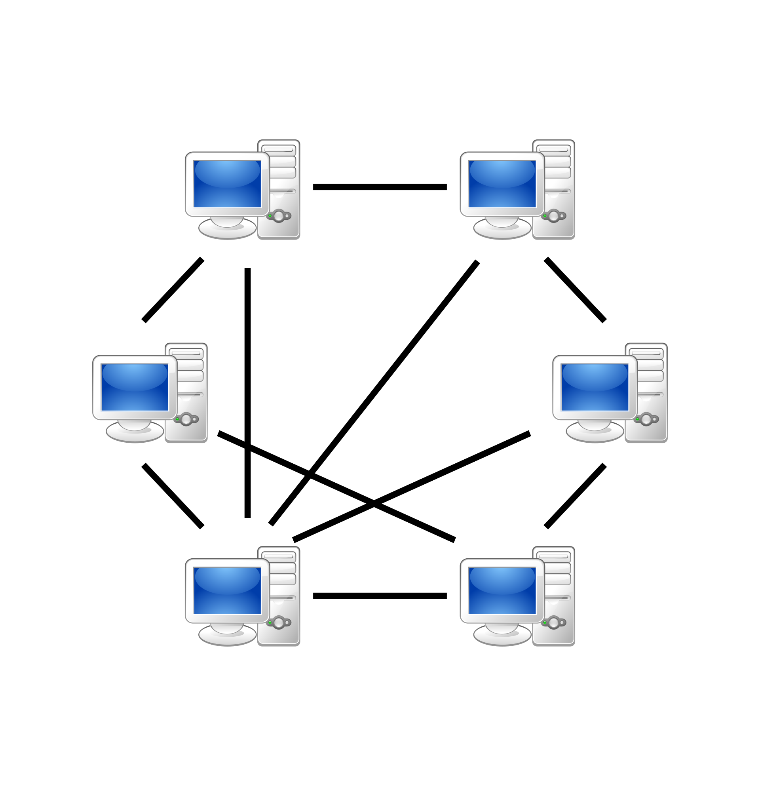

[План](./00plan.md)

# Введение в цифровые активы

Реестр - Большой справочник (банковский реестр)  
Большая не нормализованная таблица

**Учетные институты**:

- Банки
- Репозитарии — собирают и хранят данные о заключенных не на организованных торгах (вне биржи) договорах репо и договорах с деривативами.
- Регистраторы — ведут реестр владельцев ценных бумаг на основании договора с эмитентом.
- Депозитарии — хранят ценные бумаги, выступают посредниками между эмитентами и инвесторами, ведут учет сделок с ценными бумагами и перехода прав на эти бумаги.
- Клиринговые организации — посредники между участниками рынка, которые гарантируют исполнение ими взаимных обязательств: они формируют информацию по имеющимся обязательствам и новым сделкам, их зачету при поставках ценных бумаг и расчетам по ним.

Фиатные деньги - не обеспеченные золотом и другими драгоценными металлами деньги

**Проблема централизованного учета**: все данные и ресурсы хранятся и обрабатываются в едином центре или системе, следовательно сбой в центральной системе может парализовать всю организацию или процесс, а также проблемы с безопасностью данных.

Распределенный реестр - набор дублированных, совместно используемых и синхронизированных массивов цифровых данных.

Криптография - наука о методах обеспечения конфиденциальности, целостности данных, аутентификации, шифрования.

Хеш - зашифрованный пароль фиксированной длинны, без возможности дешифрации.

**Blockchain** - Цепочка блоков

Блок транзакций — структура для записи группы транзакций(заголовка и списка транзакций)
Заголовок блока включает в себя свой хеш, хеш предыдущего блока, хеши транзакций и дополнительную служебную информацию.

Содержимое блоков может быть проверено, так как каждый блок содержит информацию о предыдущем блоке.

Все блоки выстроены в одну цепочку, которая содержит информацию обо всех совершённых когда-либо операциях в базе. Регулярно возникают ситуации, когда несколько новых блоков в разных частях распределённой сети называют предыдущим один и тот же блок, то есть цепочка блоков может ветвиться.

Genesis block - Первичный блок, Одинаковый у всех узлов

Высота реестра -

#### Peer-to-Peer

#### Консенсус

Proof of Work -

Proof of Stake -

Crash Fault Tolerance (CFT) - характеристика механизма консенсуса, который продолжает работать, если часть узлов сломалась.

Byzantine Fault Tolerance (BFT) - характеристика механизма консенсуса, устойчивость к жульническим действиям узлов

|                     | Public Blockchain                                       | Private Blockchain                                                              | Hybrid |
| ------------------- | ------------------------------------------------------- | ------------------------------------------------------------------------------- | ------ |
| Механизм консенсуса | Proof-of-Work/Proof-of-Stake                            | PepperMint/YaC                                                                  |        |
| Узлы                | число может меняться динамически                        | Определенны изначально, процедура подключения и отключения строго формализована |        |
| Скорость транзакций | Медленная в виду особенностей сети механизма консенсуса | Быстрее(упрощен механизм консенсуса)                                            |        |
| Доступ к сети       | Присоединиться может каждый                             | Доступ обеспечивается администратором сети                                      |        |

PoW/PoS - алгоритмически сложные, требуется для обеспечения безопасности и отказоустойчивости(BFT+CFT)

PepperMint/YetAnotherConsensus - упрощенные по безопасности за счет доверия узлам, все равно BFT и CFT
