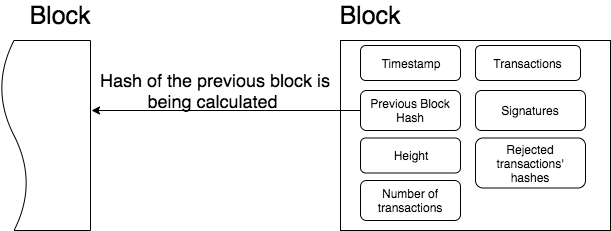
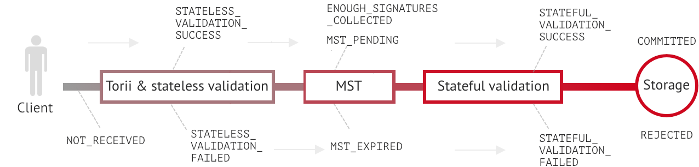
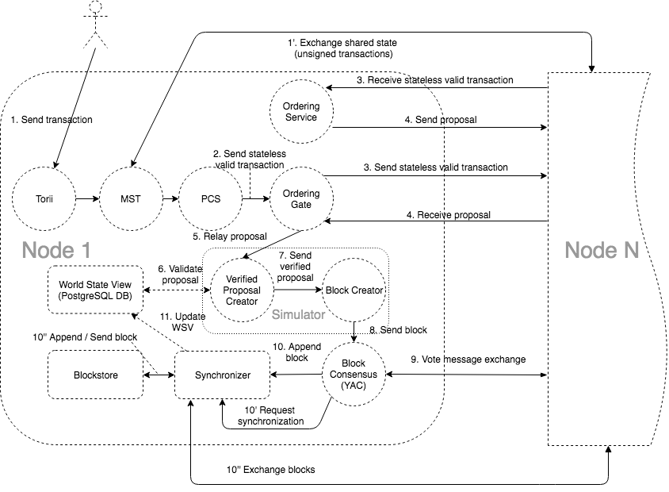

[План](./00plan.md)

# Введение в Hyperledger Iroha 1

- Доступ к blockchain осуществляется на основе ролей пользователей
- CQRS
- Управление активами и идентификацией
- api - gRPC

Что я не понимаю

1. Добавить в учебную репу
1. Все транзакции хранятся как LinkedList?
1. Каждый узел хранит 100% данных?
1. Когда происходит транзакция один инстанс проводит ее и рассылает всем остальным узлам(P2P)? условно широковещательный
1. Стейт это отдельный инстанс?
1. Как растет длительность выполнения транзакции от количества узлов
1. как сгенерировать genesisblock

Сущности системы:

1.  Домен (Domain) - Именованная абстракция для группировки учетных записей и активов(namespace одной компании)
1.  Аккаунт (Account) - принадлежит одному из существующих доменов.
    `example@domain`
1.  Block - Подписанная пирами транзакция  
    
    Outside payload:

    - signatures — подписи пиров, проголосовавших за блок во время раунда консенсуса

    Inside payload:

    - height - количество блоков в цепочке до блока
    - timestamp - Unix-время формирования блока партнером
    - array of transactions - успешно прошедших этап валидации и консенсуса
    - hash of a previous block in the chain
    - rejected transactions hashes(optional) — массив хешей транзакций, которые не прошли этап проверки с сохранением состояния

1.  Разрешение (Permission) - Право на выполнение команды.
    1. Grantable Permission - Разрешение выполнять определенные действия от имени другой учетной записи.
1.  Роль (Role) - именованная абстракция, содержащая набор разрешений.

1.  Ресурс (Asset) - Любой исчисляемый товар или стоимость.
1.  Кворум (Quorum) - Минимальное количество подписей, необходимое для того, чтобы считать транзакцию подписанной. Значение по умолчанию — 1.

1.  Proposal - множество транзакций прошедших stateless validation
1.  Транзакция (Transaction) - Упорядоченный набор команд, который применяется к реестру атомарно. Любая недействительная команда внутри транзакции приводит к отклонению всей транзакции в процессе проверки.

    1. Structure  
       Payload хранит все поля транзакции, кроме подписей:

       - Time of creation (unix time, in milliseconds)
       - Account ID of transaction creator (username@domain)
       - Quorum field
       - Repeated commands which are described in details in commands section
       - Batch meta information(optional)

       Signatures contain one or many signatures (ed25519 public key + signature)

    2. Statuses
       
       - NOT_RECEIVED: запрошенный узел не имеет этой транзакции.
       - ENOUGH_SIGNATURES_COLLECTED: транзакция с несколькими подписями, которая имеет достаточно подписей и будет проверена пиром
       - MST_PENDING: транзакция с несколькими подписями, которая должна быть подписана бОльшим количеством ключей (как указано в поле кворума).
       - MST_EXPIRED: транзакцией с мультиподписью, которая больше не действительна и будет удалена этим узлом
       - STATELESS_VALIDATION_FAILED: транзакция не прошла валидацию. Возвращается клиенту, сразу после ее отправки. Также будет возвращена причина — какое правило было нарушено.
       - STATELESS_VALIDATION_SUCCESS: транзакция успешно прошла проверку без сохранения состояния. Этот статус возвращается клиенту, сформировавшему транзакцию, сразу после ее отправки.
       - STATEFUL_VALIDATION_FAILED: транзакция содержит команды, которые нарушают правила проверки, проверяя состояние цепочки (например, баланс активов, разрешения учетной записи и т. д.). Также будет возвращена причина — какое правило было нарушено.
       - STATEFUL_VALIDATION_SUCCESS: транзакция прошла проверку с сохранением состояния.
       - COMMITTED: транзакция — это часть блока, которая набрала достаточное количество голосов и в данный момент находится в хранилище блоков.
       - REJECTED: транзакция была отклонена пиром на этапе проверки с сохранением состояния в предыдущих раундах консенсуса. Хэши отклоненных транзакций хранятся в хранилище блоков. Это необходимо для предотвращения атак повторного воспроизведения.

## Iroha внутри

### Torii
