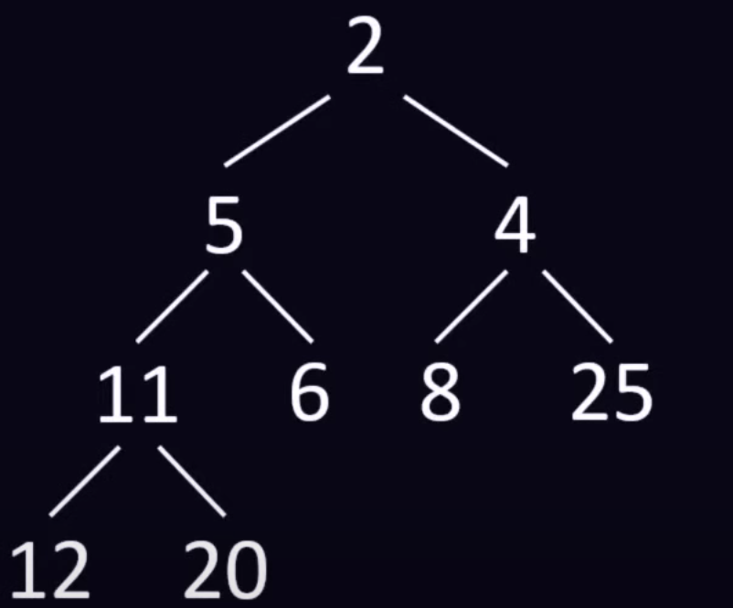

[Алгоритмы и Структуры данных](../DataStructures_and_Algorithms.md)

# Бинарная куча



Свойства:

- Значение в любой вершине не больше (если куча для минимума), чем значения её потомков.
- На *i*-ом слое $2^i$ вершин, кроме последнего. Слои нумеруются с нуля.
  $(i-1)/2$ — родитель(с округлением вниз)
  $2*i+1$ — левый сын i-го элемента
  $2*i+2$ — правый сын i-го элемента
- Последний слой заполнен слева направо (как показано на рисунке)

```jsx
export function createHeap() {
	return [];
}
export const minComparator = (a, b) => b - a;
export const maxComparator = (a, b) => a - b;
// Math.floor((i - 1) / 2) -- родитель i-го элемента
// 2 * i + 1 -- левый сын i-го элемента
// 2 * i + 2 -- правый сын i-го элемента

// Если элемент больше своего отца, условие 1 соблюдено для всего дерева, и больше ничего делать не нужно.
// Иначе, мы меняем местами его с отцом.После чего выполняем siftUp для этого отца.
// Иными словами, слишком маленький элемент всплывает наверх.
// O(log_n)
export function siftUp(heap, i = heap.length - 1, comparator = minComparator) {
	while (comparator(heap[i], heap[Math.floor((i - 1) / 2)]) > 0) {
		let parent = Math.floor((i - 1) / 2);
		// swap(heap, i, parent);
		[heap[i], heap[parent]] = [heap[parent], heap[i]];
		i = parent;
	}
}
// Если i-й элемент меньше чем его сыновья, ничего не делаем (все поддерево - куча)
// Иначе, меняем местами i-й элемент с наименьшим из его сыновей
// выполняем просеивание теперь для этого(наименьшего сына)
// O(log_n);
export function siftDown(heap, i = 0, comparator = minComparator) {
	while (2 * i + 1 < heap.length) {
		const left = 2 * i + 1;
		const right = 2 * i + 2;
		let lowestSon = left;
		if (right < heap.length && comparator(heap[right], heap[left]) > 0) {
			lowestSon = right;
		}
		if (comparator(heap[i], heap[lowestSon]) >= 0) {
			break;
		}
		// swap(heap, i, lowestSon);
		[heap[i], heap[lowestSon]] = [heap[lowestSon], heap[i]];
		i = lowestSon;
	}
}

export function pushHeap(heap, value, comparator = minComparator) {
	heap.push(value);
	siftUp(heap, heap.length - 1, comparator);
}

export function popHeap(heap, comparator = minComparator) {
	const ans = heap[0];
	heap[0] = heap[heap.length - 1];
	// heap.pop(); // not optimized
	siftDown(heap, 0, comparator);
	heap.pop(); // heuristically optimized(pop after sift)
	return ans;
}

export function buildHeap(arr, comparator = minComparator) {
	for (let i = arr.length / 2; i >= 0; i -= 1) {
		siftDown(arr, i, comparator);
	}
}
```
