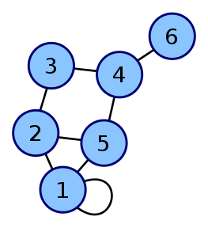
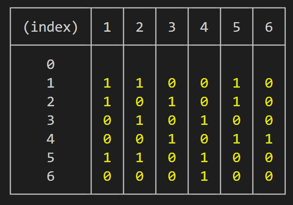

[Алгоритмы и Структуры данных](../DataStructures_and_Algorithms.md)

**Связность графа** — свойство, от любой вершины до любой вершины существует хотя бы один путь проходящий по ребрам  
**Компонента связности** — максимальный (по включению) связный подграф графа  
$V$ — вершины(количество)  
$E$ — ребра(количество)

### Представление:

#### Список ребер

| Вершина 1 | Вершина 2 | Вес ребра |
| --------- | --------- | --------- |
| 0         | 1         | 1         |
| 4         | 0         | 1         |
| 2         | 1         | 0         |

#### Матрица смежности

index — вершина  
элемент таблицы — ребро(вес, или признак ребра/его отсутствия)



Неориентированный граф и его матрица смежности


Матрица смежности для неориентированного (слева) и ориентированного (справа) графа.

У неориентированного графа матрица смежности симметрична  
У ориентированного – нет.

#### Список смежности

- <details>
  <summary><b>Для НЕориентированного графа</b></summary>

  ```jsx
  function makeAdjaencyListNotOriented(edges, vertexCount) {
  	const adjaencyList = new Array(vertexCount + 1);
  	edges.forEach(([a, b]) => {
  		if (adjaencyList[a] === undefined) {
  			adjaencyList[a] = b === undefined ? [] : [b];
  		} else {
  			adjaencyList[a].push(b);
  		}
  		if (b !== undefined) {
  			if (adjaencyList[b] === undefined) {
  				adjaencyList[b] = [a];
  			} else {
  				adjaencyList[b].push(a);
  			}
  		}
  	});

  	for (let i = 1; i <= vertexCount; i += 1) {
  		if (adjaencyList[i] === undefined) {
  			adjaencyList[i] = [];
  		}
  	}

  	return adjaencyList;
  }
  ```

</details>

- <details>
  <summary><b>Для Ориентированного графа</b></summary>

  ```jsx
  function makeAdjaencyListOriented(edges, vertexCount) {
  	const adjaencyList = new Array(vertexCount + 1);
  	edges.forEach(([a, b]) => {
  		if (adjaencyList[a] === undefined) {
  			adjaencyList[a] = b === undefined ? [] : [b];
  		} else {
  			adjaencyList[a].push(b);
  		}
  	});

  	for (let i = 1; i <= vertexCount; i += 1) {
  		if (adjaencyList[i] === undefined) {
  			adjaencyList[i] = [];
  		}
  	}

  	return adjaencyList;
  }
  ```

  </details>

## Алгоритмы:

### Обход в глубину(Depth-First Search)

**Общий алгоритм**:

- получает как аргумент элемент
  - пометить элемент как посещенный
  - для всех **непосещенных** смежных ребер этого узла вызвать DFS.
- запустить алгоритм DFS, для всех вершин(**непосещенных**)

**Применим**:

- Найти элемент в графе
  <details>
  <summary>Базовый обход в глубину: </summary>

  ```jsx
  function doDFS(graph, vertexCount) {
  	const visited = new Array(vertexCount + 1);

  	function DFS(current) {
  		visited[current] = true;
  		for (let i = 0; i < graph[current].length; i += 1) {
  			if (visited[graph[current][i]] === undefined) {
  				DFS(graph[current][i]);
  			}
  		}
  	}

  	for (let i = 1; i < graph.length; i += 1) {
  		if (visited[i] === undefined) {
  			DFS(i);
  		}
  	}

  	return visited;
  }
  ```

  </details>

- <details>
  <summary>Найти все компоненты связности графа </summary>

  ```jsx
  function doDFS(graph, vertexCount) {
  	const visited = new Array(vertexCount);
  	let component = 1;

  	function RecursiveDFS(vertex) {
  		visited[vertex] = component;
  		for (let i = 0; i < graph[vertex].length; i += 1) {
  			if (visited[graph[vertex][i]] === 0) {
  				DFS(graph[vertex][i]);
  			}
  		}
  	}

  	function IterativeDFS(vertex) {
  		const stack = [];

  		stack.push(vertex);
  		while (stack.length !== 0) {
  			vertex = stack.pop();
  			if (visited[vertex] === undefined) {
  				visited[vertex] = component;
  				graph[vertex].forEach((el) => {
  					stack.push(el);
  				});
  			}
  		}
  	}

  	for (let i = 1; i < graph.length; i += 1) {
  		if (visited[i] === undefined) {
  			IterativeDFS(i);
  			// RecursiveDFS(i);
  			component += 1;
  		}
  	}

  	return visited;
  }
  ```

  </details>

- <details>
   <summary>Определить является ли граф двудольным </summary>

  ```jsx
  function doDFS(graph, vertexCount) {
  	const visited = new Array(vertexCount);

  	function invertColor(color) {
  		return color === 1 ? 2 : 1;
  	}

  	function DFS(vertex, color) {
  		visited[vertex] = color;
  		for (let i = 0; i < graph[vertex].length; i += 1) {
  			if (visited[graph[vertex][i]] === color) {
  				return false;
  			}
  			if (visited[graph[vertex][i]] === undefined) {
  				const result = DFS(graph[vertex][i], invertColor(color));
  				if (result === false) {
  					return false;
  				}
  			}
  		}
  	}

  	for (let i = 1; i < graph.length; i += 1) {
  		if (visited[i] === undefined) {
  			const result = DFS(i, 1);
  			if (result === false) {
  				return false;
  			}
  		}
  	}

  	return true;
  }
  ```

  </details>

- <details>
   <summary>Поиск циклов в ориентированном графе (white, grey, black) </summary>

  ```jsx
  // graph - Ориентированный список смежности
  function doDFS(graph, vertexCount) {
  	// 0 - white - not visited
  	// 1 - grey - pending in current procedure
  	// 2 - black - fulfilled, all iterations is completed
  	const color = new Array(vertexCount + 1).fill(0);
  	let isCycled = false;

  	function DFS(now) {
  		color[now] = 1;
  		for (let i = 0; i < graph[now].length; i += 1) {
  			if (color[graph[now][i]] === 1) {
  				isCycled = true;
  			}
  			if (color[graph[now][i]] === 0) {
  				DFS(graph[now][i]);
  			}
  		}
  		color[now] = 2;
  	}

  	// запускаем для всех компонент связности
  	for (let i = 1; i < graph.length; i += 1) {
  		if (color[i] === 0) {
  			DFS(i);
  		}
  	}

  	return color;
  }
  ```

  </details>

- <details>
   <summary>Топологическая сортировка ориентированного ациклического графа </summary>

  Топологическая сортировка - способ нумерации вершин ориентированного графа, при котором каждое ребро ведёт из вершины с меньшим номером в вершину с большим номером.

  - Рекурсивный

    ```js
    // graph - Ориентированный список смежности
    function doDFS(graph, vertexCount) {
    	const visited = new Array(vertexCount);

    	function DFS(vertex, color) {
    		visited[vertex] = color;
    		for (let i = 0; i < graph[vertex].length; i += 1) {
    			if (visited[graph[vertex][i]] === color) {
    				return false;
    			}
    			if (visited[graph[vertex][i]] === undefined) {
    				const result = DFS(graph[vertex][i], 3 - color);
    				if (result === false) {
    					return false;
    				}
    			}
    		}
    	}

    	for (let i = 1; i < graph.length; i += 1) {
    		if (visited[i] === undefined) {
    			const result = DFS(i, 1);
    			if (result === false) {
    				return false;
    			}
    		}
    	}

    	return true;
    }
    ```

  - Итеративный

    ```js
    // graph - Ориентированный список смежности
    function doDFS(graph, vertexCount) {
    	const indegree = new Array(vertexCount + 1).fill(0);
    	const result = [];
    	const stack = [];

    	for (let i = 1; i < vertexCount + 1; i += 1) {
    		for (let j = 0; j < graph[i].length; j += 1) {
    			indegree[graph[i][j]] += 1;
    		}
    	}

    	for (let i = 1; i < vertexCount + 1; i += 1) {
    		if (indegree[i] === 0) {
    			stack.push(i);
    		}
    	}

    	while (stack.length !== 0) {
    		const currentVertex = stack.pop();
    		result.push(currentVertex);

    		for (let i = 0; i < graph[currentVertex].length; i += 1) {
    			const neighbor = graph[currentVertex][i];
    			indegree[neighbor] -= 1;

    			if (indegree[neighbor] === 0) {
    				stack.push(neighbor);
    			}
    		}
    	}

    	if (result.length !== vertexCount) {
    		return -1;
    	}

    	return result;
    }
    ```

    **Сложность:** $O(V+E)$
    </details>

### Обход в ширину(Breadth-First Search)

**Инвариант:** В очереди поиска в ширину расстояние вершин до s монотонно неубывает (возрастает).

**Общий алгоритм**:

- Объявить список дистанций
  - индекс - вершина
  - значение - количество вершин из начала
    - начальную вершину проинициализировать 0
- Объявить очередь
  - поставить в очередь начальную вершину
- Обработка очереди(пока в очереди есть хотя бы один элемент)

  - снять с очереди элемент
  - для каждого соседа этого элемента, если его нет в списке дистанций - добавить вершину в список дистанции, значение дистанции текущей+1 - добавить вершину в очередь

**Применим**:

- <details>
  <summary>Кратчайший путь в невзвешенном графе</summary>

  ```jsx
  // graph - ориентированный список смежности
  function BFS(graph, vertexCount, source, destination) {
  	const distance = new Array(vertexCount + 1).fill(Infinity);
  	distance[source] = 0;
  	const queue = [];
  	queue.push(source);
  	while (queue.length > 0) {
  		const node = queue.shift();

  		graph[node].forEach((childNode) => {
  			if (distance[childNode] === Infinity) {
  				distance[childNode] = distance[node] + 1;
  				queue.push(childNode);
  			}
  		});
  	}

  	return distance[destination] === Infinity ? -1 : distance[destination];
  }
  ```

  </details>

- Кратчайший путь(несколько начал и несколько выходов)
  отличается только тем что вначале в очередь добавляется сразу два начала
  и так как это очередь дальше обработка идет точно так же

  - Определить лежит ли вершина на кратчайшем пути из A в B

  1. запускаем BFS из точки A → `distancesA`
  2. запускаем BFS из точки B → `distancesB`
  3. проверяем, если сумма дистанций до вершины равна длинне кратчайшего пути, то вершина лежит на кратчайшем пути
     `distancesA[toCheck] + distancesB[toCheck] == distancesA[B] ? true : false`

- Если граф большой

  1. Найти все вершины находящиеся на растоянии 1 от А
  2. Найти все вершины находящиеся на растоянии 1 от B(если граф ориентированный, нужно его развернуть)
  3. посмотреть пересекаются ли полученные соседи
     1. если да, кратчайший путь найден
     2. если нет, Найти все вершины находящиеся на растоянии 2 от А и B → 3 пункт

- Граф состояний

- <details> 
  <summary>Кратчайший путь на 0-1 графе</summary>
  - Вместо очереди используем дек
    - если вес = 0, то добавляем в начало
    - если вес = 1, то добавляем в конец

  ```jsx
  function bfs01(graph, source) {
  	const distances = new Array(graph.length).fill(Infinity);
  	distances[0] = source;
  	const deque = [];
  	deque.push(source);
  	while (deque.length > 0) {
  		const current = deque.shift();
  		graph[current].forEach(([next, weight]) => {
  			if (distances[next] > distances[current] + weight) {
  				distances[next] = distances[current] + weight;
  				if (weight === 0) {
  					deque.unshift(next);
  				} else if (weight === 1) {
  					deque.push(next);
  				}
  			}
  		});
  	}
  	return distances;
  }

  const graph = [
  	/* 0: */ [
  		[1, 1],
  		[5, 0],
  	],
  	/* 1: */ [
  		[0, 1],
  		[2, 0],
  		[3, 1],
  	],
  	/* 2: */ [
  		[1, 0],
  		[3, 0],
  	],
  	/* 3: */ [
  		[1, 1],
  		[2, 0],
  		[4, 1],
  		[5, 0],
  	],
  	/* 4: */ [
  		[3, 1],
  		[8, 1],
  	],
  	/* 5: */ [
  		[0, 0],
  		[3, 0],
  		[6, 1],
  	],
  	/* 6: */ [
  		[5, 1],
  		[7, 0],
  	],
  	/* 7: */ [
  		[6, 0],
  		[8, 0],
  	],
  	/* 8: */ [
  		[4, 1],
  		[7, 0],
  	],
  ];
  const dist = bfs01(graph, 0);
  console.log(dist[8]);
  ```

  **Сложность**: $O(V+E)$
  </details>

- <details> 
  <summary>Кратчайший путь на 1-k графе</summary>
  ```jsx
  function bfs1k(graph, k, source) {
  	const distances = new Array(graph.length).fill(Infinity);
  	distances[source] = 0;
  	const visited = [];
  	const queues = new Array(k + 1).fill(0);
  	queues.forEach((el, i) => {
  		queues[i] = [];
  	});
  	queues[0].push(source);

      let countInQueues = 1;
      let currentQueue = 0;

      while (countInQueues > 0) {
      	while (queues[currentQueue % (k + 1)].length === 0) {
      		currentQueue += 1;
      	}
      	const current = queues[currentQueue % (k + 1)].shift();
      	console.log(current);
      	countInQueues -= 1;
      	if (visited[current]) {
      		continue;
      	}
      	graph[current].forEach(([next, weight]) => {
      		if (distances[next] > distances[current] + weight) {
      			distances[next] = distances[current] + weight;
      			queues[current % (k + 1)].push(next);
      			countInQueues += 1;
      		}
      	});

      	visited[current] = true;
      }
      return distances;

  }

  ```

  **Сложность:** $O(V*k + E)$

  </details>
  ```

**Сложность:** $O(V+E)$

## Взвешенный граф

### Алгоритм Дейкстры — Поиск кратчайшего(длинны) пути

**Общий алгоритм:**

- Объявить массивы посещенных вершин и дистанций до вершин
- Инициализировать начальную дистанцию
- Пока есть доступные непосещенные вершины
  - Найти минимальную непосещенную
  - Посмотреть всех ее соседей и обновить расстояние
- <details>
  <summary>Алгоритм</summary>
    список смежности `tuple[toIndex, weight]`

  ```jsx
  function dijkstra(graph, start) {
  	const visited = [];
  	const distances = new Array(graph.length).fill(Infinity);
  	const previous = [];
  	previous[start] = -1;
  	distances[start] = 0;

  	let activeVertex = findNearestVertex(distances, visited);
  	while (activeVertex !== -1) {
  		handleVertex(graph, distances, visited, previous, activeVertex);
  		activeVertex = findNearestVertex(distances, visited);
  	}

  	return distances;
  }

  function findNearestVertex(distances, visited) {
  	let minDistance = Infinity;
  	let nearestVertex = -1;

  	distances.forEach((distance, vertex) => {
  		if (!visited[vertex] && distance < minDistance) {
  			minDistance = distance;
  			nearestVertex = vertex;
  		}
  	});
  	return nearestVertex;
  }

  function handleVertex(graph, distances, visited, previous, from) {
  	graph[from].forEach(([to, weight]) => {
  		const newDist = distances[from] + weight;
  		if (newDist < distances[to]) {
  			distances[to] = newDist;
  			previous[to] = from;
  		}
  	});
  	visited[from] = 1;
  }

  const graph = [
  	/* 0 */ [
  		[1, 2],
  		[2, 1],
  	],
  	/* 1 */ [[5, 7]],
  	/* 2 */ [
  		[3, 5],
  		[4, 2],
  	],
  	/* 3 */ [[5, 2]],
  	/* 4 */ [[5, 1]],
  	/* 5 */ [[6, 1]],
  	/* 6 */ [],
  ];
  ```

  </details>

  **Сложность:**  
   релаксация — посмотреть всех соседей и обновить расстояния

  |                   | Поиск минимума | Релаксация   | Общее            |
  | ----------------- | -------------- | ------------ | ---------------- |
  | поиск ближайшего  | $O(V)$         | $O(1)$       | $O(V^2+E)$       |
  | Двоичная куча     | $O(log\, V)$   | $O(log\, V)$ | $O(E\;log\,V)$   |
  | Фибоначиевая куча | $O(log\, V)$   | $O(1)$       | $O(V\;log\,V+E)$ |
