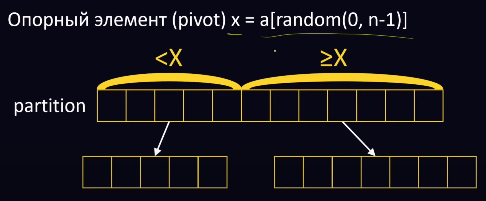

[Алгоритмы и Структуры данных](../../DataStructures_and_Algorithms.md)

# Быстрая

Обший алгоритм:


1. Выбрать опорный элемент
2. Разбить исходный массив на две части:
   1. меньше опорного
   2. больше опорного
3. Рекурсивно сделать тоже самое для получившихся подмассивов

#### Разбиение Хоара

- Двигаем левый индекс
  - если левый элемент меньше опорного → ничего не делаем
  - если левый элемент ≥ опорному элементу
    - двигаем правый индекс
      - если правый элемент ≥ опорному → ничего не делаем
      - если правый элемент меньше опорного элемента
        - меняем левый и правый

```jsx
function partitioning(arr, low, high) {
	const pivot = arr[Math.floor((low + high) / 2)];
	let i = low;
	let j = high;

	while (true) {
		while (arr[i] < pivot) {
			i += 1;
		}
		while (arr[j] > pivot) {
			j -= 1;
		}

		if (i >= j) {
			return j;
		}

		swap(arr, i, j);
		i += 1;
		j -= 1;
	}
}

function quicksort(arr, low = 0, high = arr.length - 1) {
	if (low < high) {
		const p = partitioning(arr, low, high);
		quicksort(arr, low, p);
		quicksort(arr, p + 1, high);
	}
}
```

#### Разбиение на три части

- Объявить три переменных, проинициализировать меньшим индексом
  - equal - указывает на первый элемент равный опорному элементу
  - greater - указывает на первый элемент больший опорного элемента
  - now - указывает на текущий необработанный элемент
- пока текущий индекс меньше/равен большему индексу
  - если текущий элемент больше опорного элемента
    - свап
  - если текущий элемент равен опорному элементу
    - свап текущего элемента и большего элемента
    - greater += 1
    - now += 1
  - если текущий элемент меньше опорного элемента
    - now += 1
- Вернуть equal и greater

```jsx
function partitioning(arr, low, high, predicate) {
	let equal = low;
	let greater = low;
	let now = low;

	while (now <= high) {
		if (predicate(arr[now]) >= 1) {
			const toSwap = arr[now];
			arr[now] = arr[greater];
			arr[greater] = arr[equal];
			arr[equal] = toSwap;

			equal += 1;
			greater += 1;
			now += 1;
		}
		if (predicate(arr[now]) === 0) {
			swap(arr, now, greater);
			greater += 1;
			now += 1;
		}
		if (predicate(arr[now]) <= -1) {
			now += 1;
		}
	}

	return [equal, greater];
}
function quicksort(arr, low = 0, high = arr.length - 1) {
	if (low >= high || low < 0) {
		return;
	}

	const random = arr[getRandomIntInclusive(low, high)];

	const [equal, greater] = partitioning(arr, low, high, (x) => random - x);
	quicksort(arr, low, equal - 1);
	quicksort(arr, greater, high);
}

function getRandomIntInclusive(min, max) {
	// The maximum is inclusive and the minimum is inclusive
	return Math.floor(Math.random() * (max - min + 1) + min);
}
```
