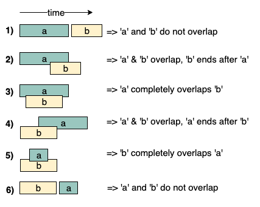

[Алгоритмы и Структуры данных](../../DataStructures_and_Algorithms.md)

Слияние интервалов(Merge Intervals)

Использовать:

- Если нужно найти пересекающиеся интервалы
- Если нужно слить(merge) пересекающиеся интервалы
- Задача
  _Дано множество числовых интервалов в случайном порядке, задача состоит в том чтобы слить(соединить) все пересекающиеся интервалы и вывести результат в котором содержатся только взаимоисключающие интервалы_
  **Input:** Intervals = {{1,3},{2,4},{6,8},{9,10}}
  **Output:** {{1, 4}, {6, 8}, {9, 10}}
  **Explanation:** Given intervals: [1,3],[2,4],[6,8],[9,10], we have only two overlapping intervals here,[1,3] and [2,4]. Therefore we will merge these two and return [1,4],[6,8], [9,10].
  **Input:** Intervals = {{6,8},{1,9},{2,4},{4,7}}
  **Output:** {{1, 9}}

  

- Брутфорс  
  Простой подход — начать с первого интервала и сравнить его со всеми другими интервалами на пересечения. Если он пересекается с каким-либо другим интервалом, объединить его с первым интервалом и удалить другой интервал из списка. Повторить те же действия для остальных интервалов после первого. Этот подход не может быть реализован за время, превышающее O(n^2).

  ```jsx

  ```

  Чтобы оптимально решить эту проблему, нам нужно сначала отсортировать интервалы по времени начала. Получив отсортированные интервалы, мы можем объединить все интервалы в один линейный обход. Идея состоит в том, что в отсортированном массиве интервалов, если **интервал[i]** не перекрывается с **интервалом[i-1]**, то интервал[i+1] не может перекрываться с интервалом[i-1], потому что время начала интервала[i +1] должно быть больше или равно интервалу [i].
