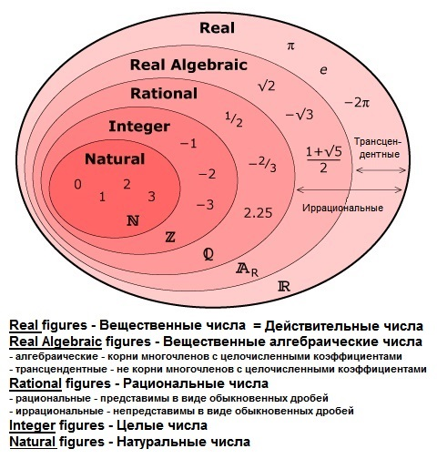
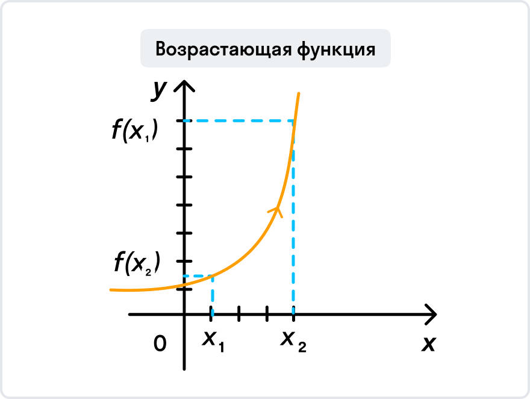
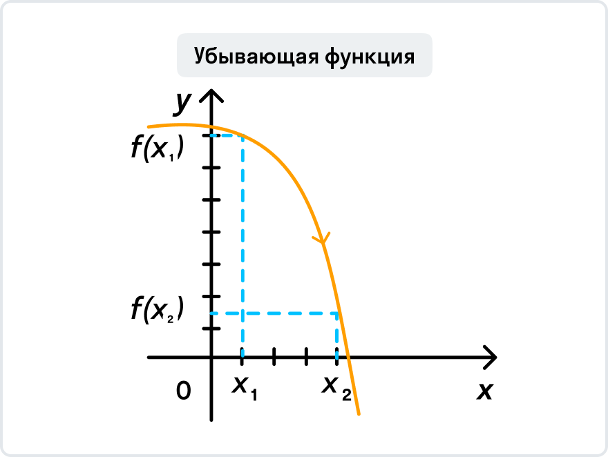
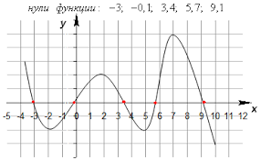
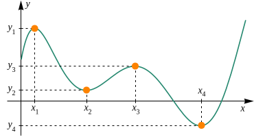
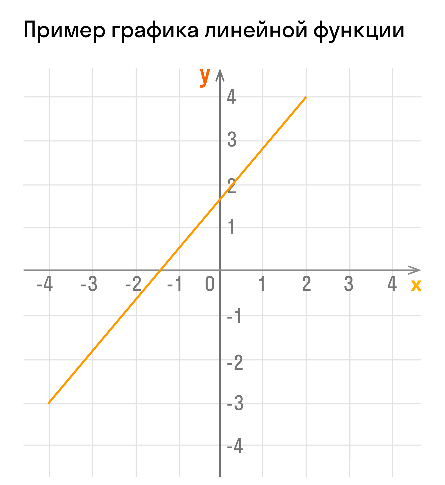
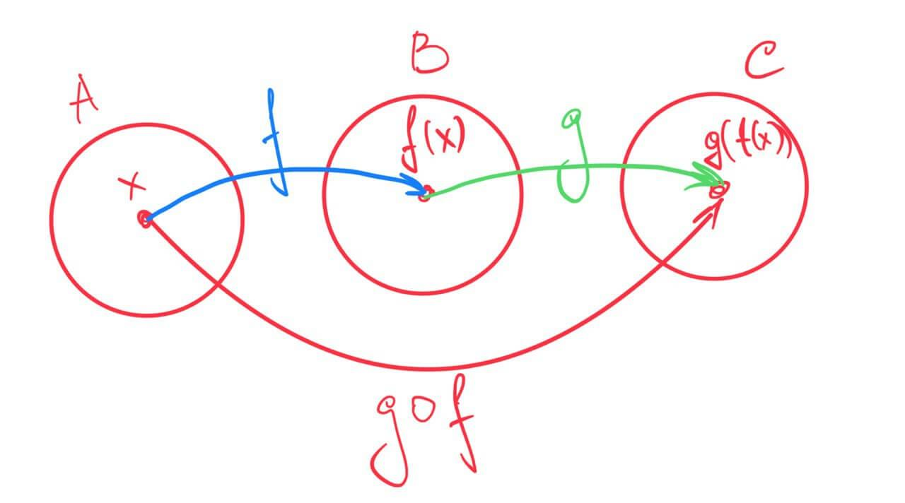

# Математика

# Введение в математику

- Числа и операции над ними
  
  **Сложение**
  $2+3=5$
  (N - Натуральные числа)
  **Вычитание**
  $5-3=2$
  $3-5=-2$
  (Z - Целое число)
  **Умножение**
  $3+3+3+3=3*4=12$
  **Деление**
  $13:4=3.25$
  (Q - Рациональное число)
  **Возведение в степень**
  $3 * 3 * 3 * 3 = 3^4 = 81$
  **Извлечение корня**
  $\sqrt[4]{81}=3$
- Свойства элементарных операций над числами
  **Коммутативный закон** — перемена мест слагаемых не влияет на результат суммы
  $a+b=b+a$
  **Коммутативный закон произведения** —
  $a*b=b*a$
  **Ассоциативный(сочетательный) закон** —
  $(a+b)+c=a+(b+c)=a+b+c$

# Функции

Функция - множество состоящее из 3 элементов $F = \{D,V,f\}$

$f:D\rightarrow V$

$f$ — **правила отображения** из области определения в область значений

$D$ — domain of function - область определения

$V$ — codomain of function - область значений

- **Классы функций:**

  - **Сюръекция(отображение на)** — каждому элементу из области значений соответсвует хотя бы один элемент из области определения.
    _отображение одного множества на другое_
    $f:D\rightarrow V$

        

        Область определения отображается на область значений

        $\forall y\in V:\exists\:x\in D$

        > Для любого $y$ принадлежащего $V$(области значений) сущестует $x$ принадлежащий D(области определения)
        >

         $f^{-1}: V \rightarrow D$— для сюръекции сложно(невозможно) построить обратную функцию
        Каждый элемент области значений имеет прообраз в области определения, но нет гарантии, что он единственный

  - **Инъекция (отображение в)** — разные элементы области определения переходят в разные элементы области значений, но не обязательно каждый элемент в области значений будет иметь прообраз в области определений.
    _отображение одного множества в другое_
    $f:D\rightarrow V$

        

        $\forall x_1,x_2 \in D, x_1\neq x_2 :\exists\: y_1,y_2 \in V , y_1\neq y_2$

        > Для любых $x_1 x_2$ не равных друг другу и принадлежащих D(области определения), неприменно существует $y_1 y_2$ не равные друг другу и принадлежащие $V$ (области значений)
        >

        $f^{-1}: V \rightarrow D$ — для инъекции сложно(невозможно) построить обратную функцию
        В области значений могут найтись такие элементы, для которых не найдется прообраза в области определения

  - **Биекция —** взаимно однозначное отображение(одновременно сюръекция и инъекция)
    $f:D\rightarrow V$
    
    У каждого элемента области значений есть прообраз в области определений И для разных элементов области определения им соответсвуют разные элементы в области значений
    $f^{-1}: V \rightarrow D$ — функция легко обратима

- Возрастание и Убывание
  
  $\forall x_1 < x_2 \in X,\exists \:y_1 < y_2 \in Y$ ⇒ функция возрастает
  
  $\forall x_1 < x_2 \in X,\exists \:y_1 > y_2 \in Y$ ⇒ функция убывает
- Нули и экстремумы

  - Нули функции — точки на оси $x$ в которых фукнция обращается в 0
    
  - Экстремумы:
    Максимум фукнкции — точка, в которой функция переходит из возрастающей в убывающую
    Минимум фукнкции — точка, в которой функция переходит из убывающей в возрастающую
    

        - Существенный супремум —
        - Существенный инфимум —

### Обратная функция

Функцию легко можно обратить, если она является биекцией
Если функция из области определений имеет однозначное отображение в область значений(_каждому $x$ соответствует только один $y$, и наоборот каждому y соответствукет только один $x$_)

Определение обратной функции:

$f^{-1}(x):
\\f(f^{-1}(x)) = x$

например:

черная линия — линия симметрии

$f(x) =x^2$ $f:\{\R_+,0\}\rightarrow\{\R_+,0\}$(первая четверть графика)

$f^{-1}(x)=x^\frac 1 2 = \sqrt x$

### Линейная функция

$f: \R \rightarrow \R$

$f(x) = kx + b$

$k,b \in \R$

$f(0) = b$

### Композиция функций

$t(x)=g\circ f(x)$

## Элементарные функции

Элементарная функция — функции, которые могут быть полученны при помощи конечного числа арифметических операций либо операций композиции над основными элементарными функциями

1. $f(x)=x^a$
2. $f(x)=a^x$
3. $f(x) = log_ax$
4. Тригонаметрические функции

   $sin(x)$
   $cos(x)$

   $tg(x)$

   $ctg(x)$

   $sec(x)$

   $cossec(x)$

   $arcsin(x)$
   $arccos(x)$

   $arctg(x)$

   $arcctg(x)$

   $arcsec(x)$

   $arccossec(x)$

5. Гиперболические функции

   $sh(x)$
   $ch(x)$

   $th(x)$

   $cth(x)$

   $sch(x)$

   $csch(x)$

   $arsh(x)$
   $arch(x)$

   $arth(x)$

   $arcth(x)$

   $arsch(x)$

   $arcsch(x)$

### Степенная функция $f(x^a)$

Если: $x>1, a>0$
$0<y< 1$
То: $x^a> 1$
$0< y^a<1$

$a>0$

$f(x)=x^a=x^{-b}=\frac 1 {x^b}$
$a<0 \;\;\;\; a=-b \;\;\;\; b>0$

# Геометрия

Евклидова геометрия - геометрическая теория, основанная на системе аксиом, впервые изложенной в «Началах» Евклида (III век до н. э.).

# Линейная алгебра

Линейное(векторное) пространство — некоторое множество объектов произвольной природы с введенным на этом множестве, операциями сложения и умножения(на число вещественное или комплексное) элементов этого множества

Сложение

Умножение

$\mathbb{V}$ над $\mathbb{R}$, $\mathbb{C}$

# Дискретная математика

| $x$ | const 0 | const 1 | x(тождественная) | $\neg$ |
| --- | ------- | ------- | ---------------- | ------ |
| 0   | 0       | 1       | 0                | 1      |
| 1   | 0       | 1       | 1                | 0      |

| $x_1$ | $x_2$ | $\wedge $ | $\vee$ | $\oplus$ | $\Leftrightarrow$ | $\Rightarrow$ | $   | $   | $\Downarrow$ |
| ----- | ----- | --------- | ------ | -------- | ----------------- | ------------- | --- | --- | ------------ |
| 0     | 0     | 0         | 0      | 0        | 1                 | 1             | 1   | 1   |
| 0     | 1     | 0         | 1      | 1        | 0                 | 1             | 1   | 0   |
| 1     | 0     | 0         | 1      | 1        | 0                 | 0             | 1   | 0   |
| 1     | 1     | 1         | 1      | 0        | 1                 | 1             | 0   | 0   |

$\wedge,\&,\cdot$ — конъюнкция(conjunction)

$\vee, +$ — дизъюнкция(disjunction) (неразделительное ИЛИ)

$\oplus$ — сумма по модулю 2(разделительное ИЛИ)

$\sim,\equiv,\Leftrightarrow, \Longleftrightarrow$ — эквивалентность

$\Rightarrow, \rightarrow$ — Импликация

$\mid$ — Штрих Шеффера

$\Downarrow,\downarrow$ — Стрелка Пирса

Лемма о числе слов — В алфавите из $r$ букв можно построить $r^m$ различных слов, длинны $m$

### Основные эквивалентности

**Коммутативность**

$x\wedge y = y \wedge x$

$x\vee y = y \vee x$

$x\oplus y = y \oplus x$

$x\sim y = y \sim x$

$x\mid y = y \mid x$

$x\downarrow y = y \downarrow x$

**Ассоциативность**

$(x \vee y) \vee z = x \vee (y \ \vee z)$

$(x \wedge y) \wedge z = x \wedge (y \ \wedge z)$

$(x \oplus y) \oplus z = x \oplus (y \ \oplus z)$

**Дистрибутивность**

$(x \vee y) \wedge z = (x \wedge z) \vee (y \wedge z)$

$(x \oplus y) \wedge z = (x \wedge z) \oplus (y \wedge z)$

$(x \wedge y) \vee z = (x \vee z) \wedge (y \vee z)$

**Правила де Моргана**

$\neg(x \vee y) = \neg x \wedge \neg y$

$\neg(x \wedge y) = \neg x \vee\neg y$

**Законы поглощения**

$x \wedge x = x$

$x \wedge \neg x = 0$

$x \wedge 1 = x$

$x \wedge 0 = 0$

$x \vee x = x$

$x \vee \neg x = 1$

$x \vee 1 = 1$

$x \vee 0 = x$

**Другие**

$\neg\neg x = x$

$x \oplus 1 = \neg x$

$x\mid y = \neg (x \wedge y)$

$x \downarrow y = \neg(x \vee y)$

$x \rightarrow y = \neg x \vee y$
