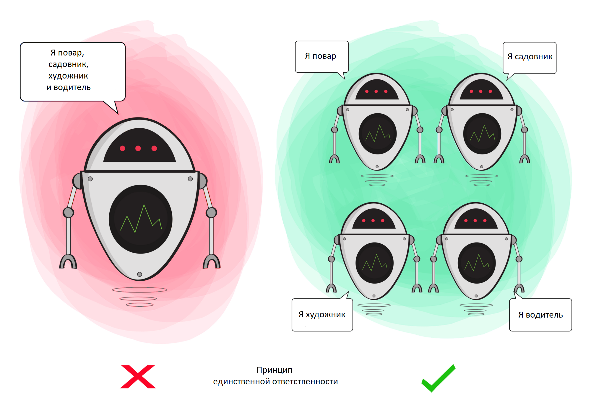
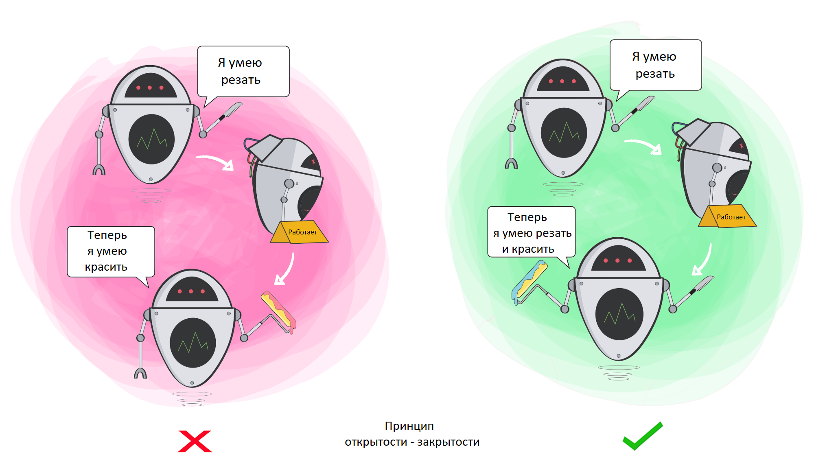
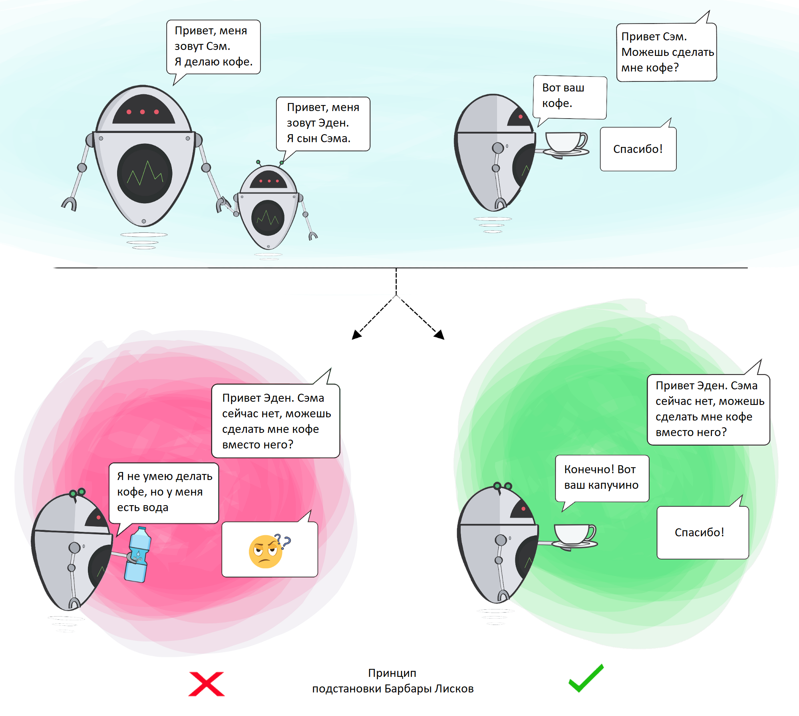
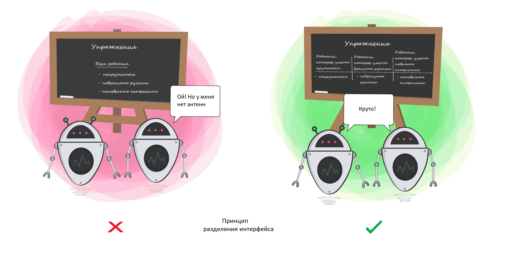
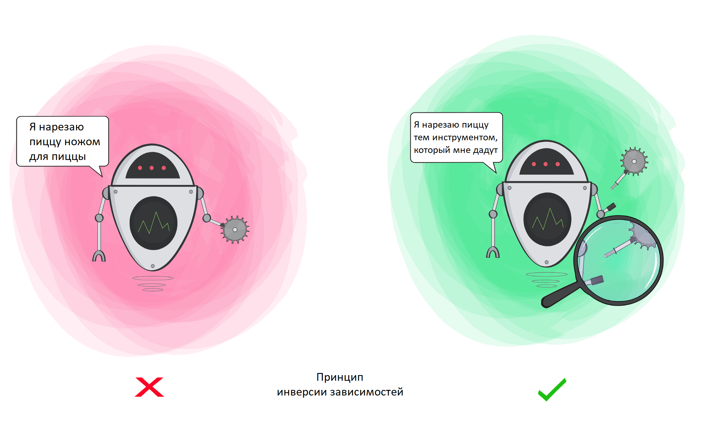

[База знаний](../README.md)

# Clean Architecture

## Structural Paradigm

_Структурное программирование накладывает ограничение на прямую передачу управления_

Заключается в смене `goto` более понятными конструкциями `if/then/else` и `do/while/until`

Структурное программирование даёт возможность рекурсивного разложения модулей на доказуемые единицы, что означает возможность функциональной декомпозиции

## Object-Oriented Programming Paradigm

_Объектно-ориентированное программирование накладывает ограничение на косвенную передачу управления_

функция превращалась → в конструктор класса  
локальные переменные → в переменные экземпляра  
Вложенные функции → в методы

- **Инкапсуляция** - Возможность определить связанные данные и функции. При обращении эти данные недоступны, а доступны только некоторые функции.

  ```c
  // point.h
  struct Point;
  struct Point* makePoint(double x, double y);
  double distance (struct Point *p1, struct Point *p2);
  // point.c
  #include "point.h"
  #include <stdlib.h>
  #include <math.h>

  struct Point* makepoint(double x, double y) {
  	struct Point* p = malloc(sizeof(struct Point));
  	p->x = x;
  	p->y = y;
  	return p;
  }

  double distance(struct Point* p1, struct Point *p2) {
  	double dx = p1->x - p2->x;
  	double dy = p1->y - p2->y;
  	return sqrt(dx * dx + dy * dy);
  }
  ```

  Пользователи _`point.h`_ не имеют доступа к членам структуры **`Point`**. Они могут вызвать функции `makePoint()` и `distance()`, но не имеют никакого представления о реализации структуры **`Point`** и функции для работы с ней

- **Наследование** - Повторное объявление группы переменных и функций в ограниченной области видимости

  ```c
  // namedPoint.h
  struct NamedPoint;

  struct NamedPoint makeNamedPoint(double x, double y, char* name);
  void setName(struct NamedPoint np, char* name);
  char* getName(struct NamedPoint np);

  // namedPoint.c
  #include "namedPoint.h"
  #include <stdlib.h>

  struct NamedPoint {
  	double x, y;
  	char* name;
  }

  struct NamedPoint* makeNamedPoint(double x, double y, char* name) {
  	struct NamedPoint* p = malloc(sizeof(struct NamedPoint));
  	p->x = x;
  	p->y = y;
  	p->name = name;
  	return p;
  }

  void setName(struct NamedPoint* np, char* name) {
  	np->name = name;
  }

  char* getName(struct NamedPoint* np) {
  	return np->name;
  }

  // main.c
  #include "point.h"
  #include "namedPoint.h"
  #include <stdio.h>

  int main(int ac, char** av) {
  	struct NamedPoint* origin = makeNamedPoint(0.0, 0.0, "origin");
  	struct NamedPoint* origin = makeNamedPoint(0.0, 0.0, "upperRight");
  	printf("distance=%f\n", distance(
  		(struct Point*) origin, // приведение к типу Point
  		(struct Point*) upperRight) // приведение к типу Point
  	);
  }
  ```

  Структура данных **`NamedPoint`** используется, как если бы она была производной от структуры **`Point`**. Поля в **`NamedPoint`** совпадают с полями **`Point`**.

  **`NamedPoint`** может маскироваться под **`Point`**, потому что в **`NamedPoint`** фактически является надмножеством **`Point`** и имеет члены, соответствующие структуре Point, следующие в том же порядке, А потому **может использовать методы `Point`.**

- **Полиморфизм** -

## Functional Paradigm

_Функциональное программирование накладывает ограничение на присваивание_

## SOLID

### [Single Responsibility Principle]()



**Принцип единственной ответственности** — Модуль должен отвечать за одного и только за одного актора

_Функция имеет единственное назначение, если вы не можете осмысленно извлечь из нее другую функцию.
Если вы можете извлечь другую функцию, то исходная функция делала больше, чем одно действие._

Принцип единственной ответственности — Модуль должен иметь одну и только одну причину для изменения.

Пользователи и заинтересованные лица → единственная причина для изменения

### [Open Closed Principle]()



**Принцип открытости/закрытости** — Программные сущности должны быть открыты для расширения и закрыты для изменения

### [Liskov Substitution Principle]()



**Принцип Подстановки Барбары Лисков** — Функции, которые используют базовый подтип, должны иметь возможность использовать подтипы базового типа, не зная об этом.

### [Interface Segregation Principle]()

**Принцип разделения интерфейсов** — программные сущности не должны зависеть от методов, которые они используют.



### [Dependency Inversion Principle]()



Принцип инверсии зависимостей —

- Модули верхних уровней не должны зависеть от модулей нижних уровней. Оба типа модулей должны зависеть от абстракций
- Абстракции не должны зависеть от деталей. Детали должны зависеть от абстракций

## Components Organization

### Coupling - отношение между компонентами

##### Reuse/Release Equivalence Principle(REP)

_Принцип эквивалентности повторного использования и выпусков — Единица повторного использования есть единица выпуска._

##### Common Closure Principle(CCP)

_Принцип согласованного изменения — В один компонент должны включаться классы, изменяющиеся по одним причинам и в одно время. В разные компоненты должны включаться классы, изменяющиеся в разное время и по разным причинам._

##### Common Reuse Principle(CRP)

_Принцип совместно повторного использования — Не вынуждайте пользователей компонента зависеть от того, чего им не требуется._

**REP** и **CCP** — _включительные_, стремятся сделать компоненты как можно крупнее.

**CRP** — _исключительный_, стремится сделать компоненты как можно мельче.

[Диаграмма противоречий принципов связности](./coupling_scheme.png)

В начале разработки наибольшую важность имеет правая сторона треугольника.

Но по мере развития и интеграции в другие проекты фокус начинает смещаться влево.

### Cohesion - связность внутри компонента

##### Acyclic Dependencies Principle(ADP)

_Принцип Ацикличности Зависимостей — Циклы в графе зависимостей недопустимы._

##### Stable Dependencies Principle(SDP)

_Принцип Устойчивых Зависимостей — Зависимости должны быть направленны в сторону устойчивости._

##### Stable Abstractions Principle(SAP)

_Принцип Устойчивости Абстракций — Устойчивость компонента пропорциональна его абстрактности._

tags:  
#Architecture  
#OOP  
#SOLID
